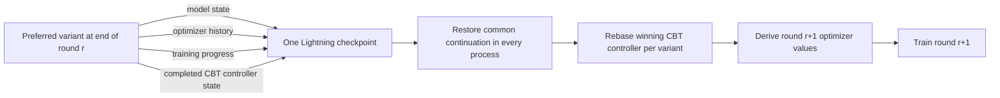

# ClanBasedTuning system architecture

Status: Milestone 3 system design  
Date: 2026-07-31  
Framework basis: PyTorch 2.10.x, Lightning 2.6.x, Ray Tune 2.56.x

## System result

ClanBasedTuning runs one live Tune function trial per Clan variant. Those trial
processes form one Lightning DDP job. During a round, Lightning DDP gives every
variant the same reduced gradient while each variant applies that gradient
through its own optimizer state and controlled values.

At the round boundary, the variants exchange their fitness through a Ray
collective. Every process therefore reaches the same CBT selection result before
anything is reported to Tune. All Lightning DDP ranks participate in the normal
checkpoint boundary, but only the preferred variant persists a checkpoint. The
preferred process reports that checkpoint to Tune; the other processes report
fitness without a checkpoint. A narrow Tune scheduler pauses the complete
population and assigns the one reported checkpoint to every trial for the next
round.

Every new round first restores the same preferred model, optimizer history,
training progress, and CBT controller lineage. Only after that common state is
loaded does each process rebase the controller for its population position,
derive its next controlled optimizer values, and apply them.

CBT defines no `Trainable` subclass, no independent training loop, no second
checkpoint format, no result-exchange actor, and no replacement for Lightning
DDP.

## The lifecycle that governs the design

```text
LOAD WINNING CHECKPOINT
│
├── restore winning model state
├── restore winning optimizer history
├── restore Lightning training-progress state
└── restore/rebase CBT controller onto the winning round state
│
▼
MUTATE FOR THIS VARIANT
│
├── derive this variant's next controlled optimizer values
└── apply them to the restored optimizer without clearing its history
│
▼
TRAIN WITH LIGHTNING DDP
│
├── each variant processes its own training partition
├── Lightning's DDP strategy uses PyTorch DDP for gradient reduction
└── each local optimizer applies the shared gradient differently
│
▼
REACH THE ROUND BOUNDARY
│
▼
CLOSE THE CLAN ROUND
│
├── compute this variant's local fitness
├── all-gather fitness through the Ray collective
├── apply CBT's configured comparison policy to the complete population
└── determine locally whether this variant is preferred
│
▼
NORMAL LIGHTNING CHECKPOINT BOUNDARY
│
├── all Lightning DDP ranks participate
├── winner: persist model, optimizer, progress, and CBT controller state
└── losers: do not persist a continuation checkpoint
│
▼
REPORT TO TUNE
│
├── every variant reports fitness and round metadata
├── winner additionally reports the Ray checkpoint wrapping its Lightning save
└── scheduler pauses every completed trial
│
▼
TUNE ASSIGNS THE ONE WINNING CHECKPOINT TO EVERY TRIAL
│
└──────────────────────────────────────────────► LOAD WINNING CHECKPOINT
```

The invariant is:

```text
common unmutated preferred continuation
→ member-local mutation
→ shared-gradient training with divergent optimizers
→ complete-population comparison
→ persist one preferred continuation
→ common unmutated preferred continuation
```

“Unmutated” here means not yet perturbed for the next round. The checkpoint
contains the exact end-of-round state of the preferred variant, including the
controlled values that produced its result. Each receiver derives the following
round's variation only after loading that checkpoint.

## Concrete two-round example

Assume a three-variant Clan and round 4.

1. Tune gives variants A, B, and C the checkpoint selected at the end of round 3.
2. Lightning restores the same model parameters, optimizer history, and training
   progress in all three processes.
3. The same winning CBT controller state is restored in all three processes.
4. Each process rebases that controller for A, B, or C and derives a different
   optimizer configuration for round 4.
5. Lightning DDP trains the three variants. Their local batches differ, their
   reduced gradients agree, and their optimizer updates diverge.
6. At validation, all three evaluate the same held-out workload and obtain local
   fitness values.
7. Their `ClanRound` objects all-gather those values through Ray. The CBT
   comparison policy prefers C. Every process reaches the same conclusion.
8. All ranks enter Lightning's checkpoint boundary. Only C persists its complete
   continuation, with C's CBT controller state included.
9. A and B call `tune.report()` with metrics and no checkpoint. C reports the same
   round information plus the Ray checkpoint containing its Lightning save.
10. The Tune scheduler pauses A, B, and C. It verifies one complete round and one
    checkpoint-bearing preferred result.
11. The scheduler installs C's checkpoint as the latest checkpoint for all three
    paused trials, using the same Tune checkpoint-assignment mechanism exercised
    by synchronous PBT.
12. Tune starts replacement trial processes for A, B, and C from C's checkpoint.
    Each process constructs an ordinary Lightning Trainer for round 5, Lightning
    restores C's continuation, and the controller rebases for the new variants.

At no point does A or B persist a full candidate checkpoint. At no point does the
scheduler run CBT's comparison or mutation policy.

## System sequence

```mermaid
sequenceDiagram
    participant A as Variant processes
    participant R as Ray collective
    participant L as Lightning DDP
    participant T as Tune scheduler

    T->>A: Start replacement trials with the same selected checkpoint
    A->>L: Trainer.fit(..., ckpt_path=selected checkpoint)
    L->>A: Restore model, optimizer, and training progress
    A->>A: Restore/rebase winning CBT controller
    A->>A: Derive and apply local optimizer values

    loop Training batches
        A->>L: Local forward/backward on partitioned data
        L->>A: Shared reduced gradient
        A->>A: Local optimizer update
    end

    A->>A: Compute local fitness on common held-out work
    A->>R: All-gather fitness
    R-->>A: Complete ordered fitness population
    A->>A: Apply CBT comparison; set preferred/not-preferred

    A->>L: All ranks enter checkpoint boundary
    L-->>A: Preferred rank persists; losing ranks do not

    A->>T: Report fitness; preferred report includes checkpoint
    T->>A: Pause and stop completed trial processes
    T->>T: Verify complete round and resolve preferred checkpoint
    T->>T: Assign the same checkpoint to every paused trial
    T->>A: Start the next generation in replacement processes
```

## State flow



The checkpoint does not contain independently manufactured next-round variants.
It contains the selected completed trajectory. Rebase and mutation manufacture
the next population after restore.

## Why the order is mandatory

### Load before mutation

The Clan has one parent. If mutation occurs before common restoration, each
receiver can inherit stale local state or one receiver's next mutation can become
part of the shared parent.

### Restore optimizer history before applying controlled values

Momentum, moments, counters, and similar state are part of the selected training
trajectory. The next controlled values modify the restored optimizer; they do
not replace it.

### Compare the complete population before checkpoint ownership

No process can know whether its continuation should survive until every required
fitness participates. The Ray all-gather is both the data exchange and the
collective synchronization for that fact.

### Save before next-round mutation

The persisted artifact must represent the preferred variant at the boundary that
was evaluated. Applying a next-round mutation before saving would privilege one
receiver's future configuration and make replay ambiguous.

### Stop the old generation after reporting

A process that reported the end of round r must not perform an optimizer update
for round r+1 from its old local state. Tune pauses and stops the completed trial
processes, assigns the preferred checkpoint, and creates the next generation from
that checkpoint.

## Framework realization

### Lightning DDP owns distributed training

“Lightning DDP” is the architectural subsystem. Lightning's `DDPStrategy` owns
Trainer integration, process-group setup, model wrapping, device placement,
barriers, backward synchronization, optimizer lifecycle, and checkpoint hooks.
PyTorch `DistributedDataParallel` is the lower-level mechanism Lightning uses for
gradient bucketing and reduction.

The Milestone 3 composition presents one externally created Tune trial process as
one Lightning DDP rank. The initial path therefore needs a focused Lightning
cluster environment and DDP strategy specialization, but those components
configure Lightning rather than bypassing it.

The strategy must preserve intended variant divergence:

- native DDP initial synchronization is retained;
- gradient synchronization is retained;
- forward-time persistent-buffer broadcast is disabled when it would overwrite
  local variant buffers; and
- parameters and optimizer history are not synchronized after local optimizer
  updates.

Training data is partitioned normally. Fitness data is replicated so each variant
sees the same held-out workload. The fitness metric must remain local and must not
use Lightning distributed metric reduction.

### Ray collectives close the population round

Ray 2.56.1 exposes `init_collective_group()` inside actor processes and a blocking
`allgather()` over a fixed world size and rank set. The Tune trials are already Ray
actors, and the Clan already requires stable ranks for Lightning DDP. The same
population mapping can initialize a separate, small Ray collective used only for
round fitness.

The gathered record is intentionally small: enough to associate each fitness
with its stable rank and completed round. It contains no model state, optimizer
state, checkpoint, or live framework object.

Every process applies the same CBT comparison policy to the same ordered gathered
values. The collective therefore returns a local boolean answer—preferred or not
preferred—without a scheduler callback, shared actor, or driver-owned policy.

### `ClanRound` owns closing one round

The natural operation belongs on the existing `ClanRound`, provisionally named
`report_fitness()`.

Its semantic sequence is:

```text
accept local fitness
→ all-gather the complete population
→ ask the CBT comparison policy which completed round is preferred
→ mark this round preferred or not preferred
→ participate in Lightning checkpointing
→ report fitness and the optional checkpoint to Tune
```

The exact Python signature is implementation design, but the responsibility is
not. `ClanRound` already represents the configuration taken into training and the
fitness returned from it. Closing that same object avoids inventing a population
coordinator class merely to sequence its completion.

Ray communication and Tune reporting remain injected integration effects so the
framework-independent controller package does not import Ray in its core policy
module.

### Lightning constructs the checkpoint

The checkpoint is not a boolean request to Tune. Lightning constructs and writes
the continuation artifact before `tune.report()`.

All Lightning DDP ranks enter `Trainer.save_checkpoint()` because Lightning's
public method constructs the framework checkpoint and ends with a strategy
barrier. CBT contributes its completed controller state through Lightning's
normal checkpoint state hooks. A narrow winner-aware strategy or checkpoint-I/O
specialization permits persistent writing only on the rank whose `ClanRound` was
preferred.

The preferred process wraps the resulting directory in a Ray `Checkpoint` and
passes it to `tune.report(metrics, checkpoint=...)`. Losing processes pass no
checkpoint. They still participate in Lightning's distributed checkpoint
boundary but perform no persistent candidate save.

### Tune's function API carries the checkpoint

CBT supplies a normal Tune function. It does not define, subclass, or ask users to
implement `ray.tune.Trainable`.

Ray internally wraps function trials in its own `FunctionTrainable`. In Ray
2.56.1 that wrapper:

- stores the latest result reported by the function;
- marks the result for checkpoint handling when the report contains a checkpoint;
- returns that latest reported result from its internal `save_checkpoint()`; and
- installs an assigned checkpoint into the function session during internal
  `load_checkpoint()` so the replacement function invocation can obtain it
  through `tune.get_checkpoint()`.

This internal wrapper is Ray's implementation detail. It is not a CBT abstraction
and no CBT class inherits from it.

### The Tune scheduler transfers, but does not choose

The custom Tune scheduler receives reports only after every process has already
participated in the Ray collective and reached the same CBT preference result.
Its job is lifecycle execution:

1. record one report for each expected trial and completed round;
2. return `PAUSE` at every Clan round boundary so no old process advances;
3. allow Tune's normal function-trial save path to retrieve the latest reported
   result from each paused process;
4. verify that exactly one complete report contains a checkpoint and that every
   report describes the same round;
5. resolve the preferred checkpoint;
6. install that checkpoint as the latest checkpoint for every paused trial; and
7. make the complete next population runnable together.

Calling internal `save()` for a losing function trial does not create a Lightning
checkpoint: its latest report contains no checkpoint. The only expensive save was
already performed by the preferred Lightning rank.

Ray's synchronous PBT implementation demonstrates the two required Tune lifecycle
operations: paused trials can be reassigned another trial's checkpoint, and their
checkpoint manager can be updated so the assigned checkpoint is used when they
start again. CBT reuses that narrow lifecycle seam but does not reuse PBT's
quantile selection, donor policy, mutation, or configuration copying.

The version-sensitive checkpoint-manager access remains isolated in the Tune
scheduler and must be protected by a direct Ray framework-contract test.

## Controller lifecycle correction

The complete lifecycle exposes a timing problem in the current Milestone 2
controller interface. Its present `advance()` sequence selects the winner and
manufactures the local next round before the winning checkpoint is persisted.
The real system requires:

```text
close current round and select the preferred completed state
→ persist that completed state
→ load it everywhere
→ rebase the restored controller
→ manufacture the receiving variant's next round
```

The accepted selection, mutation, bounds, and deterministic-state algorithms
remain useful. Their lifecycle must be separated so mutation moves to round start
after restore. This is a focused correction to the controller boundary, not a
second controller or a scheduler-owned policy.

The restored controller state is winner-derived and common. Rebase then adapts it
to the receiving population position before mutation. The rebase algorithm must
preserve the selected lineage while producing deterministic member-local
variation; it may not retain a losing controller trajectory.

## Component responsibilities

| Component | One responsibility | Receives | Produces | Does not own |
| --- | --- | --- | --- | --- |
| `ClanController` | Apply CBT selection, rebase, and mutation policy | Completed rounds or restored winning controller state | Preferred completed state or one local next round | Tune trials, DDP, checkpoint I/O |
| `ClanRound` | Carry and close one variant's round | Controlled values, local fitness, injected round effects | Preferred flag and Tune report | Population runtime or training loop |
| Ray collective integration | Exchange the small completed fitness records | One record per live rank | Same ordered population on every rank | Selection policy or checkpoints |
| Lightning cluster environment | Present Tune-created processes as one Lightning DDP world | Stable ranks and rendezvous information | Lightning rank/world configuration | Trial creation or gradient code |
| CBT Lightning DDP strategy | Preserve Clan semantics inside Lightning DDP | Lightning model and winner flag | Shared-gradient training and winner-aware checkpoint persistence | CBT selection or Tune assignment |
| Lightning checkpoint state hook | Add winner CBT continuation to the normal checkpoint | Completed controller state | Controller state inside Lightning checkpoint | Model/optimizer serialization |
| Tune function | Compose one round of ordinary Trainer execution | User workload, Tune config, assigned checkpoint | One `Trainer.fit()` invocation ending at the round report | Custom train/save/load object lifecycle |
| CBT Tune scheduler | Pause and transfer the already selected continuation | Complete round reports and one checkpoint | Same assigned checkpoint for every next trial | Fitness comparison, mutation, training |

No additional coordinator or member-adapter class is part of this design.

## Initial construction and restoration

Each replacement Tune function invocation performs ordinary composition for one
round:

1. read the stable Clan rank and collective information from its configuration;
2. initialize the Ray fitness collective;
3. construct the Lightning cluster environment, DDP strategy, and CBT hooks;
4. obtain any assigned Ray checkpoint through `tune.get_checkpoint()`;
5. expose the Lightning checkpoint file as the `ckpt_path` for `Trainer.fit()`;
6. call one ordinary `Trainer.fit()` and let Lightning own training through the
   configured round boundary; and
7. let `ClanRound` close the round, checkpoint the preferred continuation, and
   report to Tune, after which the scheduler pauses and replaces the process.

For a fresh run there is no checkpoint. Lightning DDP performs its normal initial
model synchronization, the controller creates the first local mutation from the
configured initial policy state, and training begins.

For every later round the Tune-assigned checkpoint is authoritative. Lightning
restores before CBT rebases and applies the next controlled values.

Tune's repeated function invocations do not form a CBT-owned training loop.
Lightning owns every batch, optimizer step, validation event, and checkpoint
inside each round; Tune owns trial replacement between rounds.

## Failure and completion

### Missing or failed collective participant

Ray all-gather is collective. Loss of one required process prevents a valid
fitness population. The round must time out or error, and Tune must invalidate the
complete Clan. No surviving subset may report a valid transition.

### Disagreeing round metadata

Every report carries enough round metadata for the scheduler to verify one
coherent boundary. Wrong or duplicate rounds fail before checkpoint assignment.

### Missing or multiple checkpoints

A complete transition requires exactly one checkpoint-bearing report. Zero means
no preferred continuation was persisted; more than one means the local CBT
outcomes or checkpoint gating disagreed. Both conditions fail the Clan.

### Failure during checkpoint assignment

No next trial may begin until the same preferred checkpoint has been installed
for every required member. A partial assignment fails rather than producing a
mixed generation.

### Planned completion

Completion occurs only at a common round boundary and terminates the complete
Clan. Independent per-trial early termination is incompatible with an active
shared-gradient population.

## Initial support boundary

The first executable design qualification should remain narrow:

- one process and one device per Tune trial;
- one fixed, concurrently resident population;
- one Lightning DDP world;
- one Ray fitness collective with the same stable rank mapping;
- equal-length training participation;
- replicated held-out fitness data;
- one supported optimizer mapping for controlled values;
- no competing learning-rate scheduler for those values;
- no elastic world-size change, SyncBatchNorm, FSDP, or model sharding; and
- no CBT or user-defined `Trainable` subclass.

These are initial evidence limits, not permanent architectural claims.

## Behavioral-contract traceability

| Behavioral contract | Primary lifecycle evidence |
| --- | --- |
| Common continuation at round start | Tune checkpoint assignment plus Lightning restore observations before mutation |
| Mutation after inheritance | Optimizer-history and controlled-field observations around rebase/application |
| Shared gradient | Real Lightning DDP gradient observation before the optimizer step |
| Controlled divergence | Equal-start, equal-gradient update with distinct controlled values |
| Comparable local fitness | Replicated validation workload and unreduced per-variant metrics |
| Preferred continuation | Distinguishable candidate states, one reported checkpoint, and next-round restore |
| Partial population cannot advance | Collective participant failure and scheduler no-assignment evidence |
| Repeated lifecycle | At least two complete training and transition rounds |
| Deterministic next population | Repeated restore, rebase, mutation, and first-update observation |

## Source-backed framework conclusions

The design relies on these directly inspected Ray 2.56.1 paths:

- `ray/util/collective/collective.py`: actor-local group initialization and
  blocking `allgather()`;
- `ray/tune/trainable/function_trainable.py`: reported-checkpoint retention,
  internal save returning the latest report, and internal load installing the
  assigned checkpoint into the function session;
- `ray/tune/execution/tune_controller.py`: scheduler result handling, pause/save
  ordering, checkpoint processing, and restore scheduling; and
- `ray/tune/schedulers/pbt.py`: paused-trial checkpoint reassignment through the
  trial checkpoint manager.

The Lightning checkpoint boundary is based on Lightning 2.6.1
`Trainer.save_checkpoint()`, which builds the standard Lightning checkpoint,
delegates persistence to the active strategy, and performs the distributed
strategy barrier.

These source conclusions establish a viable framework mapping. Implementation
still requires focused framework-contract tests for the exact pinned versions;
the tests qualify the design rather than replacing it.
