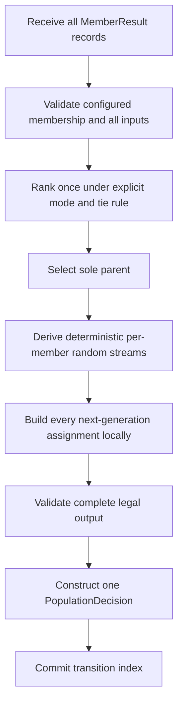

# Evolutionary controller design

Status: Work Unit 1 proposal for human review  
Date: 2026-07-24

## Purpose and authority

This design defines the independently invokable population controller delivered
by Milestone 2. It translates the governing roadmap, accepted P2–P5 decisions,
and Milestone 2 gate into a concrete public component boundary.

The design does not choose a Ray scheduler, callback, adapter, checkpoint path,
or trial lifecycle. Milestone 3 adapts Ray to the accepted controller contract.

## Main idea

> `ClanController` owns one atomic population decision: given one complete result
> for a fixed Clan membership, select the sole parent and produce one optimizer
> configuration for every member of the next generation.

The controller owns:

- fixed member identity for one Clan;
- metric direction and deterministic tie behavior;
- complete-population validation;
- sole-parent selection;
- optimizer-configuration generation from that parent;
- the transition decision and explanation record; and
- only the deterministic policy state required for later decisions.

It does not own:

- report collection or round timing;
- model parameters or optimizer state;
- optimizer construction or application;
- training, validation, data, or distributed execution;
- live trials, actors, resources, checkpoints, pause, resume, or recovery; or
- a framework adapter protocol.

## Public use

The intended reader model is:

```python
controller = ClanController(
    member_ids=("member-0", "member-1", "member-2"),
    mode="min",
    perturbation=perturbation,
    seed=17,
)

decision = controller.decide(
    (
        MemberResult("member-0", 0.42, {"lr": 0.001, "weight_decay": 0.01}),
        MemberResult("member-1", 0.37, {"lr": 0.002, "weight_decay": 0.02}),
        MemberResult("member-2", 0.51, {"lr": 0.004, "weight_decay": 0.01}),
    )
)
```

The result directly exposes the selected parent, ranked fitness evidence, and one
complete assignment for every configured member. The same call works without Ray,
Lightning, PyTorch, or a running training job.

## Data contracts

### `MemberResult`

One immutable member result contains:

- `member_id: str` — stable identity within the configured Clan;
- `fitness: float` — one comparable finite scalar; and
- `optimizer_config: Mapping[str, object]` — only the optimizer configuration the
  controller is allowed to evolve.

It deliberately does not contain a complete experiment config, model state,
checkpoint, progress counter, framework result object, or arbitrary metrics.

### `MemberTransition`

One immutable next-generation assignment contains:

- `member_id: str` — the receiving member;
- `parent_id: str` — the sole selected parent;
- `optimizer_config: Mapping[str, object]` — the receiving optimizer
  configuration; and
- `retained: bool` — whether the parent's exact optimizer configuration was
  retained rather than perturbed.

Every transition names the parent even though all transitions share it. This
keeps each assignment inspectable when logged or handled independently.

### `PopulationDecision`

One immutable decision contains:

- `transition_index: int` — the controller policy transition, not framework
  training progress;
- `mode: Literal["min", "max"]`;
- `ranking: tuple[tuple[str, float], ...]` in best-to-worst order;
- `parent_id: str`;
- `members: tuple[MemberTransition, ...]` with exact configured-member coverage;
  and
- sufficient policy information to reproduce the configuration generation.

The decision is descriptive. A later execution layer decides how to load parent
state or apply configurations.

## Perturbation boundary

The controller enforces selection, sole-parent ancestry, complete target coverage,
and atomic state transition. It delegates only the transformation of the selected
parent's optimizer configuration for one non-retained target.

The proposed narrow protocol is conceptually:

```python
class OptimizerPerturbation(Protocol):
    def __call__(
        self,
        parent_config: Mapping[str, object],
        *,
        member_id: str,
        transition_index: int,
        random: Random,
    ) -> Mapping[str, object]: ...
```

The perturbation must:

- derive its result only from the parent optimizer configuration and supplied
  deterministic inputs;
- use the supplied random generator rather than hidden random state;
- return a complete optimizer configuration with the accepted key set;
- avoid mutating its input; and
- raise rather than silently ignore an unsupported value or parameter.

This is not a second experiment-configuration language. A later built-in policy
may provide concise rules for common optimizer values, while advanced users may
supply a normal Python implementation of the protocol.

The controller does not delegate population ranking, parent choice, retention,
member coverage, state commit, or decision construction. Delegating those would
turn the policy hook into a second controller.

## Atomic decision flow



Every failure before the final commit leaves controller state unchanged and emits
no partial decision. The controller never incrementally publishes member
assignments.

## Validation contract

Construction rejects:

- fewer than two members;
- empty member identities; and
- duplicate member identities.

A decision rejects before invoking perturbation when:

- a configured member is missing;
- an unknown member is present;
- a member result is duplicated;
- fitness is NaN, infinite, boolean, or otherwise not a valid scalar;
- an optimizer configuration is not a mapping;
- an optimizer configuration is empty;
- optimizer parameter names are not non-empty strings; or
- member optimizer configurations do not describe the same parameter keys.

Generated output is built in local memory and rejected before commit when:

- perturbation does not return a mapping;
- it mutates or aliases the parent input;
- it adds or removes optimizer-configuration keys;
- it returns a structurally invalid or non-serializable value under the accepted
  policy contract; or
- any configured member lacks exactly one transition.

Domain-specific legality—such as positive learning rate or beta range—belongs to
the concrete perturbation policy because the controller cannot infer optimizer
semantics from a parameter name.

## Determinism and state

The proposed controller has one mutable policy value:

- `transition_index`, initially zero and advanced once after each successful
  decision.

Its immutable construction includes:

- configured member identities;
- metric mode;
- base seed; and
- perturbation policy.

For each non-retained member, the controller derives an independent random seed
from the base seed, transition index, parent identity, and target member identity
through a stable digest. This has three useful consequences:

- input iteration order cannot change mutation results;
- one target's perturbation cannot consume randomness intended for another; and
- the controller need not preserve a large opaque global RNG state.

`state_dict()` and `load_state_dict()` expose and restore the transition index
through an exact, versioned state contract. Missing or unexpected fields fail;
there are no silent defaults. Loading state validates that it belongs to a
controller with the same fixed population and immutable policy configuration.

A failed decision leaves `transition_index` unchanged. Repeating from the same
controller construction, state, and population input produces the same complete
decision.

## Selection policy

Ranking is independent of input order.

- `mode="min"` ranks lower finite fitness first.
- `mode="max"` ranks higher finite fitness first.
- Equal fitness is broken by stable member identity.

This default is intentionally simple and auditable. A hidden random tie choice
would make parent selection depend on policy state without scientific benefit.
A custom tie policy is not proposed until a concrete need justifies another
abstraction.

## Retention recommendation requiring acceptance

The recommended initial policy retains the selected parent's exact optimizer
configuration on the member with the same identity and perturbs every other
member from that parent configuration.

Why:

- the next generation does not discard the best observed optimizer setting;
- the retained member provides an internal control against the perturbations;
- all members still inherit the same parent model parameters and optimizer state;
- every non-parent member remains available for exploration; and
- the rule is deterministic and visible in the decision.

This is an algorithmic policy choice rather than a representation detail. The
controller contract can support another explicit retention policy, but the first
implementation should not hide the choice behind a generic hook. Human acceptance
is required before implementation fixes this default.

## Ray-native integration readiness

The design prepares for Ray without designing the adapter:

- member identity is a stable string;
- fitness is one scalar;
- optimizer configuration is an ordinary mapping rather than a package-owned
  experiment object;
- one call consumes the complete population rather than accumulating callbacks;
- one decision exposes the parent and all target configurations;
- policy state is explicit and serializable; and
- no Ray type appears in the controller package.

Milestone 3 may map stable member identities to trials, extract optimizer
configuration from trial configuration, invoke `decide()` once at a synchronized
boundary, and translate the returned assignments into native execution. The
controller does not define which Ray seam performs those operations.

## Alternatives rejected

### Make the controller a PBT scheduler

Rejected for Milestone 2 because it combines the population policy with the
framework execution mechanism and prevents the controller from being understood,
tested, and reused independently.

### Pass live trial or checkpoint objects into `decide()`

Rejected because the policy needs identity, fitness, and optimizer configuration,
not runtime ownership objects.

### Let one population-policy callback return the complete decision

Rejected because it would delegate ranking, parent authority, coverage, and state
commit to a second hidden controller. The extension boundary should be the
smallest variable behavior: optimizer perturbation.

### Accept the full experiment configuration

Rejected because the controller may evolve only optimizer-side choices. A full
experiment mapping invites accidental mutation of model, data, batch, or
integration metadata and forces later adapters to defend a boundary the public
API should state directly.

### Pass expected membership with every call

Rejected in the initial design because Clan membership is fixed by the algorithm.
Binding it at construction makes incomplete, extra, and substituted results
locally detectable and makes a population-size change require an explicit new
controller.

### Publish partial member assignments as they are generated

Rejected because a later perturbation failure would leave an invalid partial
transition. The complete decision is the atomic product.

## Focused test plan

The first implementation must prove:

- construction rejects invalid fixed membership;
- result order does not affect ranking or generated configurations;
- minimum and maximum ranking are correct;
- ties use stable member identity;
- missing, extra, and duplicate members fail before perturbation;
- invalid fitness and optimizer configuration fail before perturbation;
- one sole parent is named in every transition;
- every configured member receives exactly one optimizer configuration;
- the accepted retention rule is enforced;
- every non-retained configuration derives from the selected parent;
- perturbation cannot mutate the input or alter the parameter key set;
- identical construction, state, and input reproduce the same decision;
- different transition indexes produce the intended new perturbations;
- failed validation or perturbation does not advance state or emit a decision;
- state round-trip preserves the next decision exactly;
- records and state are serializable; and
- importing and invoking the controller requires no Ray, Lightning, or PyTorch.

## Work Unit 1 review questions

Human review should decide only the material policy points not already governed:

1. Should the selected parent's member retain the exact parent optimizer
   configuration while all other members are perturbed, as recommended?
2. Is a fixed member identity set at controller construction the correct
   completeness boundary, or is there a required use case where membership must
   vary without constructing a new controller?
3. Should the initial public perturbation boundary be the narrow per-target
   protocol above, or is there a concrete optimizer-policy requirement that
   needs population-wide configuration generation?

Once these are resolved, implementation can begin without answering any Ray-hook
question.
