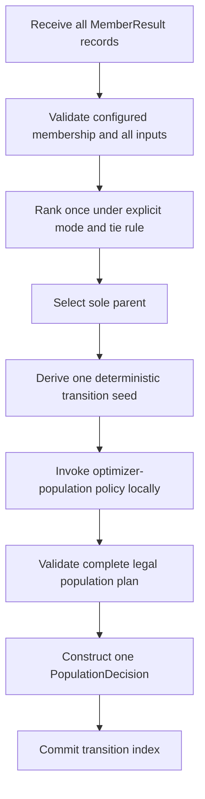

# Evolutionary controller design

Status: Work Unit 1 proposal for human review  
Date: 2026-07-24

## Purpose and authority

This design defines the independently invokable population controller delivered
by Milestone 2. It translates the governing roadmap, accepted P2–P5 decisions,
and Milestone 2 gate into a concrete public component boundary.

The design does not choose a Ray scheduler, callback, adapter, checkpoint path,
or trial lifecycle. Milestone 3 adapts Ray to the accepted controller contract.

## Main idea

> `ClanController` owns one atomic population decision: given one complete result
> for a fixed Clan membership, select the sole parent and produce one optimizer
> configuration for every member of the next generation.

The controller owns:

- fixed member identity for one Clan;
- metric direction and deterministic tie behavior;
- complete-population validation;
- sole-parent selection;
- invocation and validation of the optimizer-population policy;
- the complete transition decision and explanation record; and
- only the deterministic controller state required for later decisions.

It does not own:

- report collection or round timing;
- model parameters or optimizer state;
- optimizer construction or application;
- training, validation, data, or distributed execution;
- live trials, actors, resources, checkpoints, pause, resume, or recovery; or
- a framework adapter protocol.

## Public use

The intended reader model is:

```python
controller = ClanController(
    member_ids=("member-0", "member-1", "member-2"),
    mode="min",
    configuration_policy=configuration_policy,
    seed=17,
)

decision = controller.decide(
    (
        MemberResult("member-0", 0.42, {"lr": 0.001, "weight_decay": 0.01}),
        MemberResult("member-1", 0.37, {"lr": 0.002, "weight_decay": 0.02}),
        MemberResult("member-2", 0.51, {"lr": 0.004, "weight_decay": 0.01}),
    )
)
```

The result directly exposes the selected parent, ranked fitness evidence, and one
complete assignment for every configured member. The same call works without Ray,
Lightning, PyTorch, or a running training job.

## Evidence shaping the policy boundary

The controller is PBT-like, but its optimizer-population hook should not assume
that every target is perturbed independently.

The original [Population Based Training paper](https://arxiv.org/abs/1711.09846)
separates exploit from explore: an underperforming member may copy a better
member and then perturb or resample its hyperparameters, while a member that is
not replaced continues its existing configuration. This supports retaining an
unmodified selected configuration as a useful default.

[HDET](https://arxiv.org/abs/2604.24708) is not the Clan algorithm, but it is
relevant API evidence: it explores a structured, symmetric spread of learning
rates across replicas. A per-member-only perturbation hook would make coordinated
population layouts awkward or impossible.

The correct variable boundary is therefore the complete optimizer population
generated **after** the controller has already selected the sole parent. The hook
may coordinate configurations across targets, but it cannot see population
fitness, change the parent, collect reports, or commit controller state.

## Data contracts

The public records use frozen outer dataclasses and defensively copied ordinary
values. Optimizer mappings remain plain serialization-friendly mappings rather
than a package-owned experiment object; the controller snapshots them rather than
claiming deep immutability of arbitrary nested user values.

### `MemberResult`

One member result contains:

- `member_id: str` — stable identity within the configured Clan;
- `fitness: float` — one comparable finite scalar; and
- `optimizer_config: Mapping[str, object]` — only the optimizer configuration the
  controller is allowed to evolve.

It deliberately does not contain a complete experiment config, model state,
checkpoint, progress counter, framework result object, or arbitrary metrics.

### `OptimizerPopulationPlan`

The configuration policy returns one complete local plan containing:

- `configurations: Mapping[str, Mapping[str, object]]` — exact configured-member
  coverage; and
- `record: Mapping[str, object]` — serialization-friendly policy information
  needed to explain the generated population.

The plan is not emitted directly. The controller validates it, constructs the
final ancestry records, and commits state only after the entire plan is valid.

### `MemberTransition`

One next-generation assignment contains:

- `member_id: str` — the receiving member;
- `parent_id: str` — the sole selected parent;
- `optimizer_config: Mapping[str, object]` — the receiving optimizer
  configuration; and
- `retained: bool` — whether the configuration exactly retains the parent's
  optimizer configuration.

Every transition names the parent even though all transitions share it. This
keeps each assignment inspectable when logged or handled independently.

### `PopulationDecision`

One decision contains:

- `transition_index: int` — the controller policy transition, not framework
  training progress;
- `mode: Literal["min", "max"]`;
- `ranking: tuple[tuple[str, float], ...]` in best-to-worst order;
- `parent_id: str`;
- `members: tuple[MemberTransition, ...]` with exact configured-member coverage;
- `policy_record: Mapping[str, object]`; and
- the deterministic seed used for the optimizer-population policy.

The decision is descriptive. A later execution layer decides how to load parent
state or apply configurations.

## Optimizer-population policy boundary

The controller enforces selection, sole-parent ancestry, complete target coverage,
validation ordering, and atomic state transition. It delegates only the optimizer
population derived from the already-selected parent configuration.

The proposed protocol is conceptually:

```python
class OptimizerPopulationPolicy(Protocol):
    def __call__(
        self,
        parent_config: Mapping[str, object],
        *,
        parent_id: str,
        member_ids: tuple[str, ...],
        transition_index: int,
        seed: int,
    ) -> OptimizerPopulationPlan: ...
```

The policy must:

- derive every result from the parent optimizer configuration and supplied
  deterministic inputs;
- use the supplied seed rather than hidden random state;
- return exactly one complete optimizer configuration for every supplied member;
- return the accepted optimizer-parameter key set for every member;
- avoid mutating its input; and
- raise rather than silently ignore an unsupported value or parameter.

The complete-population input permits coordinated layouts, symmetric spreads,
collision avoidance, or an explicit retained control. It does not make the hook
a second controller because the hook receives no fitness population and cannot
rank members, choose ancestry, change membership, publish a decision, or commit
state.

This is not a second experiment-configuration language. The initial package
should provide one small concrete policy for common optimizer exploration while
allowing a normal Python implementation of the protocol for advanced policies.

## Atomic decision flow



Every failure before the final commit leaves controller state unchanged and emits
no partial decision. The controller never incrementally publishes member
assignments.

## Validation contract

Construction rejects:

- fewer than two members;
- empty member identities;
- duplicate member identities;
- an unsupported metric mode; or
- an invalid base seed.

A decision rejects before invoking the configuration policy when:

- a configured member is missing;
- an unknown member is present;
- a member result is duplicated;
- fitness is NaN, infinite, boolean, or otherwise not a valid scalar;
- an optimizer configuration is not a mapping;
- an optimizer configuration is empty;
- optimizer parameter names are not non-empty strings; or
- member optimizer configurations do not describe the same controlled parameter
  keys.

The controller snapshots validated inputs before passing the parent configuration
to user policy. Generated output is built in local memory and rejected before
commit when:

- the policy does not return `OptimizerPopulationPlan`;
- configuration coverage differs from the configured member set;
- a generated configuration is not a mapping or is empty;
- a generated configuration adds or removes controlled optimizer keys;
- a generated value or policy record violates the accepted serialization
  contract; or
- any configured member lacks exactly one final transition.

Domain-specific legality—such as positive learning rate or beta range—belongs to
the concrete configuration policy because the controller cannot infer optimizer
semantics from a parameter name.

## Determinism and state

The controller has one mutable policy value:

- `transition_index`, initially zero and advanced once after each successful
  decision.

Its immutable construction includes:

- configured member identities in canonical order;
- metric mode;
- base seed; and
- configuration policy.

For each decision, the controller derives one transition seed from the base seed,
transition index, parent identity, and fixed membership through a stable digest.
The configuration policy uses that seed to generate the complete optimizer
population. This makes output independent of result iteration order without
forcing every policy into independent per-member random streams.

The configuration policy contract forbids hidden mutable random or policy state.
A future policy that genuinely requires additional state must expose it through a
reviewed controller-state contract rather than smuggling it through the hook.

`state_dict()` and `load_state_dict()` expose and restore an exact version and
transition index. Missing or unexpected fields fail; there are no silent
defaults. Immutable construction is recreated explicitly by the caller. The
state contract does not pretend it can serialize or compare arbitrary user policy
code.

A failed decision leaves `transition_index` unchanged. Repeating from the same
controller construction, state, and population input produces the same complete
decision.

## Selection policy

Ranking is independent of input order.

- `mode="min"` ranks lower finite fitness first.
- `mode="max"` ranks higher finite fitness first.
- Equal fitness is broken by stable member identity.

This default is intentionally simple and auditable. A hidden random tie choice
would make parent selection depend on policy state without scientific benefit.
A custom tie policy is not proposed until a concrete need justifies another
abstraction.

## Initial configuration-policy recommendation requiring acceptance

The recommended initial built-in policy is PBT-like but population-wide:

- the selected parent's member receives the exact parent optimizer configuration;
- every other member receives a perturbation derived from that parent;
- all configurations are generated together in canonical member order; and
- the policy record identifies retention and the operation applied to each
  controlled optimizer value.

Why retain the exact parent configuration:

- the next generation does not discard the best observed optimizer setting;
- the retained member provides an internal control against the perturbations;
- all members still inherit the same parent model parameters and optimizer state;
- every non-parent member remains available for exploration; and
- ordinary PBT likewise leaves a strong member unchanged while replaced members
  copy and explore from stronger configurations.

Why generate the population together:

- simple independent perturbation remains easy;
- coordinated or symmetric exploration remains possible;
- duplicate avoidance or deliberately assigned roles do not require abusing
  member identity inside isolated callbacks; and
- the policy record can explain the whole exploration layout at once.

This is an algorithmic policy choice rather than a representation detail. Human
acceptance is required before implementation fixes the retention and initial
perturbation semantics.

## Ray-native integration readiness

The design prepares for Ray without designing the adapter:

- member identity is a stable string;
- fitness is one scalar;
- optimizer configuration is an ordinary mapping rather than a package-owned
  experiment object;
- one call consumes the complete population rather than accumulating callbacks;
- one decision exposes the parent and all target configurations;
- controller state is explicit and serialization-friendly; and
- no Ray type appears in the controller package.

Milestone 3 may map stable member identities to trials, extract optimizer
configuration from trial configuration, invoke `decide()` once at a synchronized
boundary, and translate the returned assignments into native execution. The
controller does not define which Ray seam performs those operations.

## Alternatives rejected

### Make the controller a PBT scheduler

Rejected for Milestone 2 because it combines the population policy with the
framework execution mechanism and prevents the controller from being understood,
tested, and reused independently.

### Pass live trial or checkpoint objects into `decide()`

Rejected because the policy needs identity, fitness, and optimizer configuration,
not runtime ownership objects.

### Use a per-member-only perturbation hook

Rejected because it unnecessarily forbids coordinated population exploration.
The complete-population policy remains narrow by receiving only the selected
parent configuration and target identities.

### Let the configuration policy return the final controller decision

Rejected because it would delegate ranking, parent authority, ancestry, decision
construction, and state commit to a second hidden controller. The policy returns
only a candidate optimizer-population plan for controller validation.

### Accept the full experiment configuration

Rejected because the controller may evolve only optimizer-side choices. A full
experiment mapping invites accidental mutation of model, data, batch, or
integration metadata and forces later adapters to defend a boundary the public
API should state directly.

### Pass expected membership with every call

Rejected in the initial design because Clan membership is fixed by the algorithm.
Binding it at construction makes incomplete, extra, and substituted results
locally detectable and makes a population-size change require an explicit new
controller.

### Publish partial member assignments as they are generated

Rejected because a later policy or validation failure would leave an invalid
partial transition. The complete decision is the atomic product.

## Focused test plan

The first implementation must prove:

- construction rejects invalid fixed membership, mode, and seed;
- result order does not affect ranking or generated configurations;
- minimum and maximum ranking are correct;
- ties use stable member identity;
- missing, extra, and duplicate members fail before policy invocation;
- invalid fitness and optimizer configuration fail before policy invocation;
- the policy receives only the selected parent config and fixed target identities;
- one sole parent is named in every transition;
- every configured member receives exactly one optimizer configuration;
- a population-wide policy can coordinate results across members;
- the accepted built-in retention rule is enforced;
- every generated configuration derives from the selected parent and preserves
  the controlled key set;
- user policy cannot mutate the stored input snapshot;
- identical construction, state, and input reproduce the same decision;
- different transition indexes produce the intended new policy seed;
- failed validation or policy execution does not advance state or emit a
  decision;
- state round-trip preserves the next decision exactly;
- records and state satisfy the accepted serialization contract; and
- importing and invoking the controller requires no Ray, Lightning, or PyTorch.

## Work Unit 1 review questions

Human review should decide only the material policy points not already governed:

1. Should the selected parent's member retain the exact parent optimizer
   configuration while all other members explore from it, as recommended?
2. Is a fixed member identity set at controller construction the correct
   completeness boundary, or is there a required use case where membership must
   vary without constructing a new controller?
3. Is the population-wide configuration-policy boundary appropriately narrow, or
   is there a concrete reason the controller itself should own the first
   perturbation algorithm without a public policy hook?
4. For the initial built-in policy, should common numeric parameters use the
   classic PBT-style multiply-by-0.8-or-1.2 rule, or should the first policy be a
   more explicit user-supplied population generator until optimizer-domain rules
   are designed in Work Unit 3?

Once these are resolved, implementation can begin without answering any Ray-hook
question.
