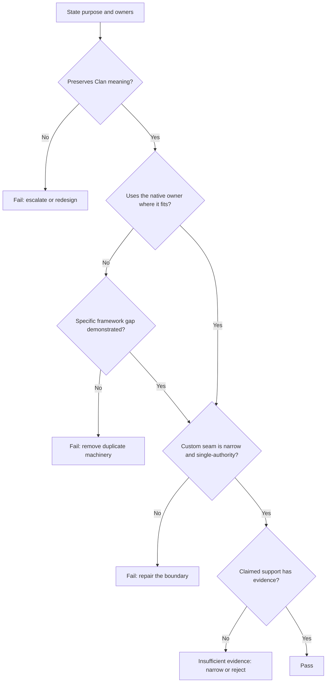

# Framework-native engineering review

Status: proposed standing go/no-go review  
Date: 2026-07-24

## Purpose

Use this review whenever a design or implementation changes a meaningful
ClanBasedTuning boundary. It answers one question:

> Does this unit preserve the Clan mechanism while leaving ordinary framework
> behavior with its native owner?

This is not a design specification or milestone plan. Component-specific
requirements and detailed support gates remain with the artifact that owns that
work.

## How to apply it

State the unit's purpose, inputs, outputs, lifecycle position, and owners. Then
apply the checks in order. Stop at the first failure, repair the owning design,
and repeat the review. Record implementation-specific findings outside this
standing file.

## 1. Preserve the Clan mechanism

Confirm that the unit preserves the algorithmic properties established by the
roadmap and accepted decisions: live members contribute to shared-gradient
training, variation remains optimizer-side during a round, fitness is
comparable, and one parent supplies the next generation.

**Fail** when engineering convenience changes one of those properties. That is
a product decision, not a local implementation choice.

## 2. Use the native owner

Trace every responsibility in the unit to its current owner in PyTorch,
Lightning, Ray Tune, or ClanBasedTuning. Use the framework owner unchanged when
its contract already fits.

**Fail** when ClanBasedTuning repeats ordinary scheduling, training, validation,
distribution, checkpoint, optimizer, data, or lifecycle behavior merely to make
it locally convenient.

## 3. Require a demonstrated framework gap

Custom behavior requires a concrete gap statement:

- the Clan behavior required;
- the native behavior that conflicts with or omits it;
- the smallest seam capable of bridging the difference.

**Fail** when the justification is symmetry, generality, possible future use,
compatibility with the proof of concept, or preference for local control.

## 4. Keep one authority and a narrow seam

The custom seam must add only the missing Clan behavior. State and decisions
must have one authoritative owner, and removing the seam should remove the
Clan-specific behavior without taking an ordinary framework lifecycle with it.

**Fail** when responsibilities overlap, configuration is mirrored without need,
or custom machinery mainly exists to coordinate other custom machinery.

## 5. Match support to evidence

For every version-sensitive, distributed, persistence, or failure boundary,
identify the direct source or executable contract test and state the support
envelope it establishes.

Return **insufficient evidence** when the ownership appears correct but the
claimed behavior has not been qualified. Narrow the claim or reject the
configuration before expensive work begins.

## Result

- **Pass:** all five checks hold for the claimed support envelope.
- **Fail:** the unit changes Clan meaning, duplicates a native owner, or creates
  conflicting authority.
- **Insufficient evidence:** the boundary is plausible, but the support claim is
  not yet established.

## Supporting documents

- [Product roadmap](../product_roadmap.md)
- [Decision register](decision_register.md)
- [Evidence ledger](evidence_ledger.md)
- [Integration research backlog](integration_research_backlog.md)
