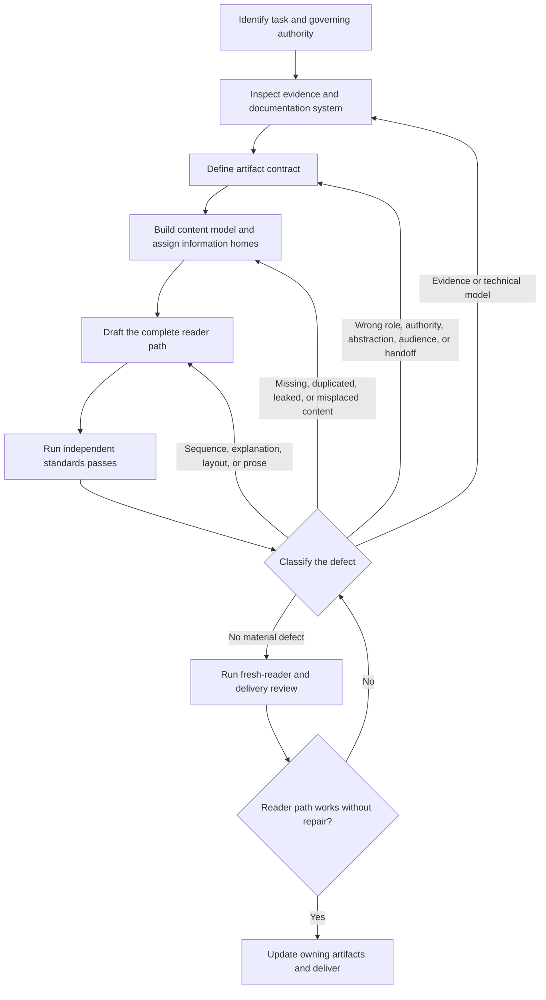

# Business-technical writing workflow

Use this workflow for substantial ClanBasedTuning writing: roadmaps, decisions,
gates, designs, plans, reports, audits, READMEs, user guidance, reference
documentation, docstrings, and technical explanations.

This file defines the execution loop. The
[technical-writing standards](technical_writing_standards.md) define how to judge
the work. Begin here; consult only the standards relevant to the current stage or
defect.

The workflow is iterative. A review defect sends the work back to the stage that
owns the problem. Do not force every correction through a local prose edit.

## Control flow

## Stage 1 — identify the task and governing authority

**Purpose:** establish the requested writing result and which artifacts may
govern or be changed.

**Produce:**

- the requested artifact or reader result;
- the governing roadmap, decision, gate, accepted design, scoped plan,
  implementation, evidence, or review material;
- the artifact that owns the requested change; and
- any authority or scope change requiring human consultation.

Proceed when the task and authority are clear. Inspect more repository state when
the owner is uncertain. Ask the smallest necessary question when the user has not
supplied the current objective or a required authority decision.

Do not infer authority from a file's detail, recency, or proximity. In
particular, a plan does not become a gate because it is more specific, and a gate
does not become an implementation plan because it must be complete.

## Stage 2 — inspect evidence and the documentation system

**Purpose:** establish the real technical model and relevant reader path before
designing prose.

**Produce:**

- verified facts and direct sources;
- inference, intent, commitment, hypothesis, candidate scope, and open questions;
- relevant entry points, neighboring artifacts, public surfaces, and existing
  authoritative homes; and
- discovered gaps classified as writing, product, API, implementation,
  ownership, gate, design, plan, or unresolved-decision work.

Do not make the target document absorb every discovered gap.

Return here whenever review finds an unsupported claim, incorrect mechanism,
missing source, or unresolved technical contradiction.

## Stage 3 — define the artifact contract

**Purpose:** decide the artifact's unique transmission job and abstraction level
before drafting it.

**Produce:**

- standalone or participating boundary;
- artifact role and authority;
- the stable abstraction this artifact exposes;
- subordinate details that remain encapsulated in linked owners;
- audience and assumed starting model;
- reader purpose and required post-reading result;
- prerequisites and handoffs; and
- expected reading path.

For milestone work, classify the artifact before writing:

- **Roadmap:** defines project capability and sequence.
- **Gate:** contracts the broadest acceptable solution space needed for safe and
  sufficient downstream progress.
- **Design:** selects and explains one solution inside the gate.
- **Durable plan:** governs execution of an accepted design inside one active
  gate.
- **Scratch or option analysis:** supports current reasoning but has no durable
  authority unless explicitly promoted through review.

A gate describes what must be true, including failure boundaries and evidence,
without assuming the only ways success or failure can occur. A plan may be
narrower because it pursues one accepted solution, but it may never narrow the
gate or predesign later milestones.

A durable plan must state the active gate it serves and stop at that boundary.
When current work discovers a condition that future work genuinely must satisfy,
route that condition to the owning future gate for explicit review rather than
leaving it as a forward promise in the current plan.

Continue when the artifact has one coherent job at one deliberate abstraction
level. Return to Stage 1 when the request belongs to another authority or
artifact, and to Stage 2 when the contract depends on unresolved evidence.
Consult the user before changing accepted authority, milestone meaning,
scientific interpretation, or material scope.

## Stage 4 — build the content model and assign information homes

**Purpose:** design the reader's model and cross-document allocation before
writing finished prose.

**Produce:**

- the central claim, mechanism, or task flow;
- the facts, limits, evidence, decisions, and dependencies the reader needs;
- the order in which the reader must learn them;
- one primary home for each material point;
- the project-level or component-level abstraction stated here;
- links or brief orientation for information owned below that abstraction; and
- explicit follow-up work for gaps outside the current artifact.

Documentation should preserve the same encapsulation expected of the technical
design. A higher-level artifact states the stable capability, contract, or
relationship and links to the lower-level owner. It does not repeat work-unit
order, option analysis, class details, or framework seams merely to become
locally complete.

Apply these tests before drafting a roadmap, gate, design, or plan:

- **Alternate-solution:** could materially different implementations satisfy the
  gate? If not, is the mechanism truly invariant?
- **Counterfactual validity:** could the roadmap result be fully achieved while
  violating this proposed gate clause?
- **Plan deletion:** would the gate remain complete if every plan and design
  vanished?
- **Downstream sufficiency:** can the next milestone rely on the gate result
  without knowing its implementation?
- **Upward leakage:** did a class, hook, schema, policy detail, or work order enter
  a higher artifact only because the current plan uses it?
- **Milestone containment:** does the plan stop at its active gate rather than
  designing later work?
- **Unforeseen failure:** does the gate reject unsafe outcomes broadly enough
  without enumerating only currently imagined failure modes?

Also ask:

> If a subordinate plan, design, or implementation changed without changing this
> artifact's promised abstraction, would this artifact remain correct?

If not, either lower-level detail has leaked upward or the higher-level contract
is not actually stable. Return to Stage 3 when the abstraction is wrong; remain
here when the information allocation is wrong.

Prefer causal relationships and meaningful contrasts over inventories of
implementation detail.

Return here when review finds missing concepts, duplicated material, orphan
facts, a wrong information home, an abstraction leak, milestone leakage, or a
broken cross-document path.

## Stage 5 — draft the complete reader path

**Purpose:** turn the content model into one coherent working draft.

Write the complete source-order argument or task flow, including necessary
headings, transitions, links, tables, diagrams, examples, and references. Do not
optimize isolated passages while the document model remains unstable.

Remain here for defects limited to sequence, explanation, layout, terminology,
sentence structure, or local precision. Return to an earlier stage when a prose
defect exposes a deeper contract, abstraction, evidence, milestone, or
information-ownership problem.

## Stage 6 — run independent standards passes

Run these independent passes from the
[standards](technical_writing_standards.md):

1. contract;
2. technical credibility;
3. information architecture;
4. precision;
5. status and register; and
6. compression.

Record material defects before editing and identify the stage that owns each one.

| Defect | Return to |
| --- | --- |
| Unsupported claim, wrong mechanism, missing evidence | Stage 2 |
| Wrong document type, authority, audience, abstraction, milestone scope, prerequisite, or handoff | Stage 3 |
| Missing concept, duplication, orphan, abstraction leak, cross-milestone leakage, or wrong primary home | Stage 4 |
| Poor order, explanation, layout, terminology, or prose | Stage 5 |
| Proposed change to accepted project meaning or authority | Human consultation, then the owning stage |

During the information-architecture pass, deliberately test encapsulation:

- Does the artifact expose the abstraction its reader needs?
- Are lower-level details reachable through clear links?
- Could those details change behind the boundary without making this artifact
  false?
- Does a change ripple upward only when the higher-level contract actually
  changes?
- Does a durable plan remain inside one active gate?
- Has any current design choice been promoted into gate authority without review?

Do not resolve a Stage 2–4 defect by polishing Stage 5 prose around it. After a
correction, rerun every materially affected pass. Treat new criticism as evidence
against the complete model, not as a replacement writing theory.

## Stage 7 — run fresh-reader and delivery review

Enter through the path a technically literate reader would plausibly use. Verify
that the reader can build the intended model without repair, that authority and
status remain legible, that abstraction and milestone boundaries are visible,
and that links, examples, tables, and handoffs work.

Ask:

> Where would a technically literate reader build the wrong model, lose the
> thread, doubt the writer, or have to reread?

Also ask:

> Which details in this artifact would become stale after an internal change that
> should have remained encapsulated?

For gates and plans, ask separately:

> Does the gate still admit every acceptable solution, and does the plan stop at
> the gate it serves?

When an answer exposes a defect, classify it and follow the corresponding
backward edge. Before delivery, update every artifact that owns an accepted
correction and record remaining work outside the current artifact.

## Completion condition

Writing is complete when:

- the requested artifact fulfills one clear contract at the intended abstraction;
- the technical model and strongest claims are supported;
- every material point has an appropriate primary home;
- subordinate detail remains encapsulated behind real, navigable handoffs;
- gates preserve the full acceptable solution space;
- durable plans remain authoritative only within one declared active gate;
- the reader path is coherent, efficient, and navigable;
- status and authority are accurate;
- the fresh-reader pass succeeds; and
- all accepted corrections are made in the artifacts that own them.

A polished draft is not complete when the underlying evidence, artifact role,
abstraction, milestone scope, information architecture, or authority remains
wrong.
