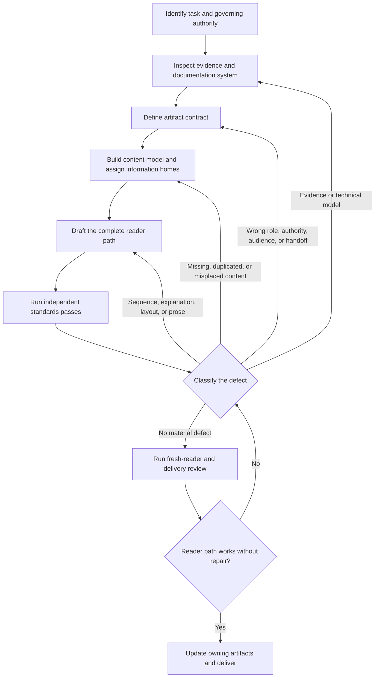

# Business-technical writing workflow

Use this workflow for substantial ClanBasedTuning writing: roadmaps, decisions,
designs, plans, reports, audits, READMEs, user guidance, reference documentation,
docstrings, and technical explanations.

This file defines the execution loop. The
[technical-writing standards](technical_writing_standards.md) define how to judge
the work. Begin here; consult only the standards relevant to the current stage or
defect.

The workflow is iterative. A review defect sends the work back to the stage that
owns the problem. Do not force every correction through a local prose edit.

## Control flow

## Stage 1 — identify the task and governing authority

**Purpose:** establish what writing result is requested and which artifacts may
govern or be changed.

**Inputs:** the user request, repository instructions, current project status, and
known authoritative documents.

**Produce:** a short working statement of:

- the requested artifact or reader result;
- the governing roadmap, decision, gate, plan, implementation, evidence, or
  review material;
- the artifact that owns the requested change; and
- any authority or scope change requiring human consultation.

**Next edge:**

- proceed when the task and authority are clear;
- inspect more repository state when the owning artifact is uncertain; or
- ask the smallest necessary question when the user has not supplied the current
  objective or a required authority decision.

Consult the standards sections on artifact contracts and authority only when
needed.

## Stage 2 — inspect evidence and the documentation system

**Purpose:** establish the real technical model and the relevant reader path
before designing prose.

**Inputs:** governing artifacts, current document, implementation, tests,
comments, public interfaces, neighboring documents, and direct technical
evidence relevant to the task.

**Produce:** a bounded evidence map containing:

- verified facts and direct sources;
- inference, intent, commitment, hypothesis, candidate scope, and open questions;
- relevant entry points, neighboring artifacts, and public surfaces;
- existing authoritative homes for the concepts involved; and
- discovered gaps classified as writing, product, API, implementation,
  ownership, or unresolved-decision work.

Do not make the target document absorb every discovered gap.

**Backward edge:** return here whenever review finds an unsupported claim,
incorrect mechanism, missing source, or unresolved technical contradiction.

## Stage 3 — define the artifact contract

**Purpose:** decide the artifact's unique transmission job before drafting it.

**Inputs:** the task statement and evidence map.

**Produce:** an explicit contract covering:

- standalone or participating boundary;
- artifact role and authority;
- audience and assumed starting model;
- reader purpose and required post-reading result;
- prerequisites and handoffs; and
- expected reading path.

**Decision:**

- continue when the artifact has one coherent job;
- return to Stage 1 when the request belongs to another authority or artifact;
- return to Stage 2 when the contract depends on unresolved evidence; or
- consult the user before changing accepted authority, milestone meaning,
  scientific interpretation, or material scope.

## Stage 4 — build the content model and assign information homes

**Purpose:** design the reader's model and the cross-document allocation before
writing finished prose.

**Inputs:** the accepted artifact contract and evidence map.

**Produce:**

- the central claim, mechanism, or task flow;
- the facts, limits, evidence, decisions, and dependencies the reader needs;
- the order in which the reader must learn them;
- one primary home for each material point;
- links or brief orientation for information owned elsewhere; and
- explicit follow-up work for uncovered gaps outside the current artifact.

Prefer causal relationships and meaningful contrasts over inventories of
implementation detail.

**Backward edge:** return here when review finds missing concepts, duplicated
material, orphan facts, a wrong information home, or a broken cross-document
path.

## Stage 5 — draft the complete reader path

**Purpose:** turn the content model into one coherent working draft.

**Inputs:** the artifact contract and content model.

**Produce:** a complete source-order draft, including necessary headings,
transitions, links, tables, diagrams, examples, and references.

Write the whole argument or task flow before optimizing isolated passages. Keep
enough connective tissue for each section to inherit the right model from the
previous one.

**Backward edge:** remain here for defects limited to sequence, explanation,
layout, terminology, sentence structure, or local precision. Return to an earlier
stage when the prose defect exposes a deeper contract, evidence, or
information-ownership problem.

## Stage 6 — run independent standards passes

**Purpose:** evaluate the draft without allowing one concern to replace the whole
quality model.

Run the relevant independent passes from the
[standards](technical_writing_standards.md):

1. contract;
2. technical credibility;
3. information architecture;
4. precision;
5. status and register;
6. compression; and
7. fresh-reader behavior.

Record material defects before editing. For each defect, identify its owning
stage.

### Defect routing

| Defect | Return to |
| --- | --- |
| Unsupported claim, wrong mechanism, missing evidence | Stage 2 |
| Wrong document type, authority, audience, prerequisite, or handoff | Stage 3 |
| Missing concept, duplication, orphan, or wrong primary home | Stage 4 |
| Poor order, explanation, layout, terminology, or prose | Stage 5 |
| Proposed change to accepted project meaning or authority | Human consultation, then the owning stage |

Do not resolve a Stage 2–4 defect by polishing Stage 5 prose around it.

After correction, rerun all materially affected passes. Treat new criticism as
evidence against the complete model, not as a replacement writing theory.

## Stage 7 — run fresh-reader and delivery review

**Purpose:** prove that the completed reader path works from its real entry point
and that the changes landed in their proper homes.

**Inputs:** the corrected artifact and every prerequisite or outward link needed
for the promised path.

**Produce:**

- a source-order read from the likely entry point;
- confirmation that the reader can build the intended model without repair;
- confirmation that authority and status remain legible;
- confirmation that links, examples, tables, and handoffs work;
- updates to every owning artifact changed by the accepted correction; and
- an explicit record of remaining work outside the current artifact.

Ask:

> Where would a technically literate reader build the wrong model, lose the
> thread, doubt the writer, or have to reread?

When the answer exposes a defect, classify it and follow the corresponding
backward edge. Deliver only when no material defect remains and further
compression would cost more understanding than it saves.

## Completion condition

Writing is complete when:

- the requested artifact fulfills one clear contract;
- the technical model and strongest claims are supported;
- every material point has an appropriate primary home;
- the reader path is coherent, efficient, and navigable;
- status and authority are accurate;
- the fresh-reader pass succeeds; and
- all accepted corrections are made in the artifacts that own them.

A polished draft is not complete when the underlying evidence, artifact role,
information architecture, or authority remains wrong.
