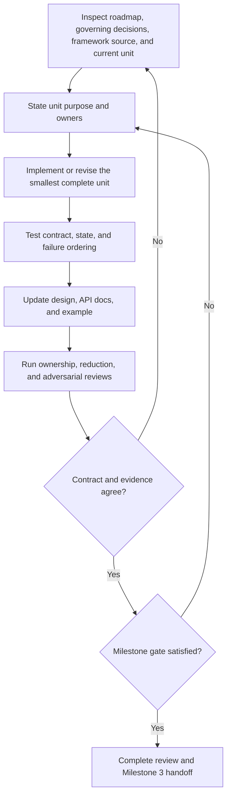

# Evolutionary-controller milestone plan

Status: proposed Milestone 2 execution plan pending Milestone 1 closure  
Date: 2026-07-24

## Governing inputs

This plan is governed by:

- the [product roadmap](../product_roadmap.md);
- the accepted [project decisions](../decisions/project_decisions.md), except for
  the explicitly reopened P3, P4, and P7 clauses until their replacements are
  accepted;
- the [Milestone 2 gate](gates/milestone_2_evolutionary_subsystem.md);
- the [framework-native review](../reviews/framework_native_review.md).

The plan is an execution route, not a second acceptance contract. Reopening a
specific clause does not suspend unrelated accepted decisions.

## Purpose

Produce the Milestone 2 result: an independently invokable evolutionary
controller that owns only the population decision required by Clan Tuning and
uses the narrowest justified PBT-like framework responsibility.

## Products developed together

Milestone 2 develops one coherent controller product consisting of:

- an accepted controller-form design decision;
- the public population input and transition-decision contract;
- deterministic selection and optimizer-configuration policy;
- focused policy, invalid-input, state, and failure-ordering tests;
- version-specific framework-contract tests for the chosen seam;
- controller design, API/reference, limitation, and failure documentation;
- an independently runnable example with inspectable input and output;
- the Milestone 3 integration handoff.

Implementation, tests, documentation, example, and handoff evolve with each work
unit. They are not postponed until the code is otherwise complete.

## Controller main idea

> Given one complete population result, select the sole parent and produce one
> legal optimizer configuration for every member of the next generation.

The controller owns population policy and only the state required to reproduce
that policy. It emits a decision for native framework execution. It does not run
training, transfer model state, construct optimizers, manage trial resources, or
own checkpoint contents.

## Work loop

Each work unit follows the same backward-capable loop:

A work unit may reopen an earlier unit when evidence changes the controller form,
public contract, or policy. Do not preserve an earlier draft with compensating
state or adapter machinery.

## Work unit 1 — choose the controller form

### Purpose

Resolve the roadmap's explicit choice between specializing Ray's synchronous PBT
scheduler and using an independent controller with a thin Ray adapter. Do not
make later implementation depend on one option before this choice is reviewed.

### Evidence work

Inspect the qualified Ray source and build the smallest executable probes needed
to compare:

1. **Narrow PBT specialization**
   - where the complete population decision is invoked;
   - what member identities, metrics, configurations, and scheduler state are
     available;
   - whether the Clan parent and next configurations can be expressed without
     reproducing Tune controller behavior;
   - how much private or version-sensitive surface is required.

2. **Independent controller plus thin adapter**
   - what plain controller input/output can remain framework-neutral;
   - what adapter translation is required to reach Tune's native execution path;
   - whether the adapter would duplicate ranking, report accumulation,
     checkpoint, pause/resume, resource, or trial lifecycle behavior;
   - what policy state must be persisted and by whom.

### Decision criteria

Select the option that best preserves:

- one population-policy authority;
- independent controller invocation;
- native Tune lifecycle ownership;
- the smallest version-sensitive seam;
- auditable inputs, outputs, and state;
- maintainability and concision without sacrificing correctness.

### Exit products

- dated controller-form design decision;
- source/probe evidence and alternative analysis;
- selected seam contract and version assumptions;
- updated public-contract constraints;
- explicit evidence that would reopen the choice.

## Work unit 2 — define the public population and decision contracts

### Purpose

Make the policy independently invokable and keep framework objects out of the
public model where they add no contract value.

### Work

Define the smallest representation for:

- a complete member population result;
- member identity and comparable fitness;
- current optimizer configurations;
- intentional policy state, when required;
- the sole parent and complete next-generation optimizer configurations;
- an inspectable explanation or decision record.

Prefer plain immutable structures where they express the contract clearly. Do
not introduce a package-wide experiment schema, checkpoint model, or framework
object wrapper.

### Exit products

- reviewed public input/output contract;
- validation and serialization tests for intentional state and records;
- API/reference draft;
- example skeleton showing the proposed reader model.

## Work unit 3 — implement deterministic parent selection

### Purpose

Produce one valid and explainable parent decision from one complete population.

### Work

Implement and test:

- metric direction;
- stable tie behavior;
- missing, duplicate, NaN, infinite, and incomplete population handling;
- deterministic winner identity;
- complete next-generation member coverage;
- the decision explanation required for audit and example output.

Keep the policy limited to information available in the accepted public
population contract. Do not add a report accumulator, progress clock, trial
registry, or checkpoint manager.

### Exit products

- focused selection and validation tests;
- visible winner reasoning in the decision record and example;
- updated policy and failure documentation.

## Work unit 4 — implement optimizer-only configuration generation

### Purpose

Generate the next optimizer population without changing the shared-gradient
workload.

### Work

Define and test the smallest policy surface that:

- derives every next-generation optimizer configuration from the selected
  parent's optimizer configuration and accepted policy state;
- produces legal values for every member;
- rejects model, data, batch, augmentation, and other gradient-defining choices;
- documents any retention, mutation, resampling, or boundary behavior chosen by
  the controller design.

Use native Ray mutation facilities only where they match the public controller
contract. Do not create a second general experiment-configuration language.

### Exit products

- configuration-policy and invalid-surface tests;
- public configuration reference;
- inspectable example output;
- justification for every policy abstraction added.

## Work unit 5 — complete state and failure ordering

### Purpose

Retain only the controller state required by the accepted policy and chosen
framework seam, and ensure incomplete populations cannot produce valid
transitions.

### Work

Implement and test:

- deterministic policy state and random-state handling, where applicable;
- persistence/restore only for state the chosen seam genuinely requires;
- refusal of incomplete or invalid populations;
- no partial decision emission after a policy failure;
- clear distinction between controller failure and framework-owned execution
  failure.

Trial termination, checkpoint assignment, training restoration, and operational
recovery remain outside this controller unit.

### Exit products

- state round-trip and failure-ordering tests;
- failure and limitation documentation;
- final decision-record contract.

## Work unit 6 — finish the public controller product

### Purpose

Make the subsystem independently usable, reviewable, and ready for manual
integration.

### Work

- complete the controller design and option-decision record;
- complete public API, configuration, decision-record, limitation, and failure
  documentation;
- complete focused tests and the selected framework-seam contract suite;
- build the standalone public example with explicit population input and
  inspectable decision output;
- explain how to run the example and interpret the result;
- produce the Milestone 3 handoff containing the public inputs, outputs, state,
  selected seam, framework assumptions, and responsibilities that remain outside
  the controller.

### Exit condition

Implementation, tests, documentation, example, design decision, and handoff agree
on one controller contract and satisfy the Milestone 2 gate. Any unresolved
framework question required for manual integration is recorded in the handoff,
not silently absorbed into the controller.
