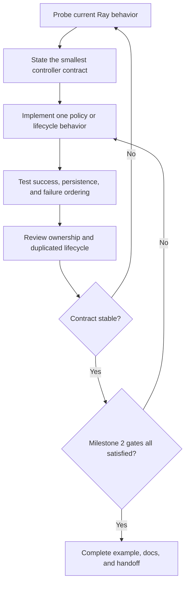

# Evolutionary-controller milestone plan

Status: proposed Milestone 2 execution plan  
Date: 2026-07-24  
Governing inputs:
[product roadmap](../product_roadmap.md),
[project decisions](../decisions/project_decisions.md),
[Milestone 2 gates](gates/milestone_2_evolutionary_subsystem.md),
[framework-native review](../reviews/framework_native_review.md)

## Milestone result

Deliver an independently invokable evolutionary controller that expresses the
population-decision side of Clan Tuning through the narrowest viable
specialization of synchronous Ray PBT.

The controller receives a complete population boundary, selects one parent,
retains one elite optimizer configuration, makes the parent state the sole
basis of the next generation, produces optimizer-only target configurations,
and either continues or completes the entire population.

This milestone does not build the Lightning or DDP integration that produces
real training reports and checkpoints.

## Controller boundary

The controller owns:

- fitness direction and deterministic ranking policy;
- sole-parent selection;
- elite handling;
- optimizer-only mutation policy;
- validation of the configuration surface it mutates;
- collective continue or planned-completion decision;
- policy state required by the selected Ray PBT seam.

It does not own:

- training or validation cadence;
- metric computation;
- model or optimizer construction;
- checkpoint contents;
- DDP setup or collectives;
- dataloaders;
- resource admission;
- member-local Lightning checkpoint generation;
- general optimizer mapping.

## Execution method

Work proceeds one contract at a time. Each implemented unit is tested, reviewed
against the standing framework-native review, and allowed to revise the local
design before the next unit begins.

## Work unit 1: qualify the synchronous PBT seam

### Purpose

Establish the exact Ray behavior the controller will specialize before private
methods or state become design assumptions.

### Work

Build the smallest native Tune test that demonstrates:

- at least three trials in synchronous PBT;
- one report from every live trial at a population boundary;
- source checkpoint preparation before exploitation;
- checkpoint and configuration assignment to targets;
- pause and resume ordering;
- two consecutive population decisions.

Then specialize the population partition so one deterministic winner is the
only source candidate and every other live trial is a target.

### Repair condition

If this requires reproducing substantial Tune controller behavior or
coordinating trials outside PBT, stop and reopen project decision P3 with the
observed evidence.

### Exit evidence

A version-pinned executable contract test states the exact upstream assumptions
and fails clearly when they change.

## Work unit 2: qualify native experiment restoration

### Purpose

Determine whether Ray already preserves the specialized scheduler and trial
population across interruption before considering any Clan-specific recovery
state.

### Work

Using synthetic trainables and checkpoints, interrupt and restore:

- immediately after a completed population decision;
- while a synchronous population boundary is partially assembled;
- after a target has received a source checkpoint but before the next complete
  population report, when the native lifecycle exposes that state.

Use `Tuner.restore` and native persistent experiment state. Inspect restored
scheduler state, trial configuration, checkpoint lineage, pause status, and the
next population decision.

### Repair condition

Do not add a generation manifest or custom transaction merely because the state
is difficult to inspect. Add recovery machinery only after direct evidence shows
that native Ray restoration cannot recover or explicitly reject an incoherent
population state.

### Exit evidence

The restored run either continues from one coherent population state or fails
explicitly in every tested interruption location.

## Work unit 3: implement deterministic parent selection

### Purpose

Make the sole-parent population transition explicit and independently testable.

### Work

Define and test:

- metric and direction;
- complete population input;
- stable tie behavior;
- missing, NaN, infinite, duplicate-member, and incomplete population handling;
- deterministic handling of equal fitness values;
- winner identity and target set;
- one unmutated elite configuration.

Keep the policy limited to information already present at a Ray population
boundary. Do not introduce a second report accumulator, generation coordinator,
or checkpoint manager.

## Work unit 4: constrain optimizer-only mutation

### Purpose

Prevent Ray's general trial-configuration mutation surface from changing values
that define the shared-gradient workload.

### Work

Choose the smallest configuration contract that identifies mutable optimizer
values without becoming a second experiment schema. Reject model, data, batch,
augmentation, and other gradient-defining mutation during setup.

Use native Ray mutation behavior where it expresses the accepted policy. Add
custom mutation logic only for a demonstrated Clan-specific gap.

## Work unit 5: implement collective completion and invalid-population behavior

### Purpose

Ensure the controller cannot independently complete, continue, or repair one
member.

### Work

Find the narrowest Ray-native seam that can decide at a complete boundary to:

- select a parent and continue the whole population; or
- identify the final best member and complete the whole population.

Reject ordinary per-trial stopping for the supported path. Define how missing
results, trial errors, and population-size changes invalidate the current
population decision.

The controller need not terminate DDP processes; Milestone 3 owns distributed
termination behavior.

## Work unit 6: public contract, auditability, and example

### Purpose

Make the subsystem usable and inspectable without constructing Lightning or DDP.

### Work

- Persist only policy state the selected PBT seam requires.
- Document parent selection, elite behavior, mutation boundary, tie behavior,
  restoration assumptions, and failure semantics.
- Expose enough transition information to inspect source, targets, checkpoint
  lineage, and resulting optimizer configuration.
- Build a small native Ray example whose trainables report synthetic fitness and
  real checkpoints through Tune.

## Milestone closure

Close Milestone 2 only through the
[Milestone 2 gate file](gates/milestone_2_evolutionary_subsystem.md). The plan is
an execution route, not a substitute for gate evidence.

The handoff to Milestone 3 consists only of the public controller contract and
native Ray outputs: trial configuration, selected source checkpoint, population
result, restoration behavior, and collective scheduling outcome.
