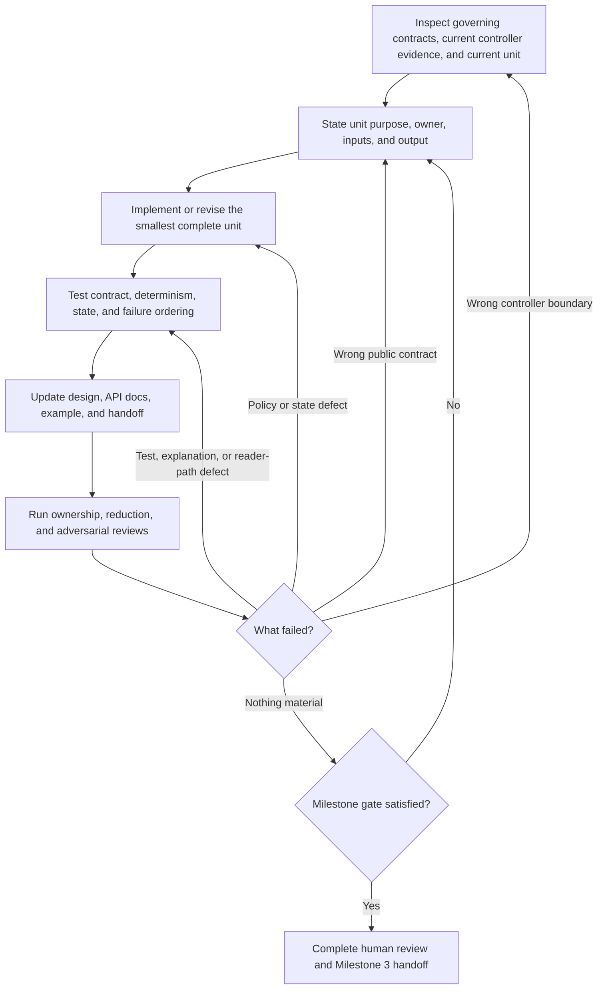

# Evolutionary-controller milestone plan

Status: active Milestone 2 execution plan  
Date: 2026-07-24

## Governing inputs

This plan is governed by:

- the [product roadmap](../product_roadmap.md);
- the accepted [project decisions](../decisions/project_decisions.md);
- the [Milestone 2 gate](gates/milestone_2_evolutionary_subsystem.md); and
- the [framework-native review](../reviews/framework_native_review.md).

The plan is an execution route, not a second acceptance contract. The Milestone 2
gate determines completion.

## Purpose

Produce an independently invokable evolutionary controller that owns one complete
Clan population decision and only the policy state required to reproduce that
decision.

Milestone 2 defines **what the controller is**. Milestone 3 determines **how Ray
invokes it and executes its output**.

The controller must nevertheless be designed for that immediate consumer. Its
input and output should map naturally to ordinary Ray trial identities, result
values, and configuration mappings without importing Ray objects or adapter
lifecycle into the public policy model.

## Products developed together

Milestone 2 develops one coherent controller product consisting of:

- the public population input and transition-decision contract;
- deterministic sole-parent selection;
- optimizer-only next-generation configuration policy;
- intentional policy state and reproducibility behavior;
- focused policy, invalid-input, serialization, and failure-ordering tests;
- controller design, API/reference, limitation, and failure documentation;
- an independently runnable example with inspectable input and output; and
- an integration-readiness handoff for Milestone 3.

Implementation, tests, documentation, example, and handoff evolve with each work
unit. They are not postponed until the code is otherwise complete.

## Controller main idea

> Given one complete population result, select the sole parent and produce one
> legal optimizer configuration for every member of the next generation.

The controller owns population policy and only the state required to reproduce
that policy. It emits a decision for framework-owned execution. It does not
collect reports, choose round timing, run training, transfer model or optimizer
state, construct optimizers, manage trials or resources, or own checkpoints.

## Work loop

Each work unit follows the same backward-capable loop:

A work unit may reopen an earlier unit when evidence changes the public contract,
policy, or state model. Do not preserve an earlier draft with compensating
framework, adapter, registry, or recovery machinery.

## Work unit 1 — define the controller design and public contracts

### Purpose

Establish the controller's main idea, ownership boundary, and independently
invokable input/output model before policy implementation grows around an
accidental representation.

### Evidence work

Inspect:

- the Clan round and single-parent mechanism in the roadmap;
- accepted P2 through P5 responsibility decisions;
- the current scheduler, tests, optimizer configuration path, and examples only
  as proof-of-concept evidence;
- ordinary Python representations capable of preserving identity, fitness,
  optimizer configuration, policy state, and decision explanation; and
- the data that a later Ray integration can naturally supply or consume without
  introducing a second experiment schema.

Do not investigate or select a Ray scheduler hook in this unit. The relevant
question is whether the controller contract itself creates unnecessary adapter
work, not which adapter will eventually call it.

### Work

Define the smallest representation for:

- one member result with stable identity, comparable fitness, and current
  optimizer configuration;
- one complete population result with explicit completeness semantics;
- metric direction and any controller configuration;
- the sole parent;
- one resulting optimizer configuration and explicit parent identity for every
  next-generation member;
- intentional policy state, when required; and
- an inspectable decision record.

Prefer plain immutable and serialization-friendly structures where they express
the contract clearly. Do not introduce a package-wide experiment schema,
checkpoint model, trial wrapper, report accumulator, or generic framework adapter
protocol.

### Exit products

- reviewed controller design and ownership statement;
- reviewed public input/output contract;
- validation and serialization test skeletons;
- API/reference draft;
- example skeleton showing the reader model; and
- explicit integration-readiness constraints for later units.

## Work unit 2 — implement deterministic parent selection

### Purpose

Produce one valid and explainable parent decision from one complete population.

### Work

Implement and test:

- metric direction;
- stable tie behavior;
- missing, duplicate, NaN, infinite, and incomplete population handling;
- deterministic winner identity;
- complete next-generation member coverage; and
- the winner explanation required for audit and example output.

Keep the policy limited to information available in the accepted public
population contract. Do not add a progress clock, trial registry, checkpoint
manager, or lifecycle callback.

### Exit products

- focused selection and validation tests;
- visible winner reasoning in the decision record and example; and
- updated policy and failure documentation.

## Work unit 3 — implement optimizer-only configuration generation

### Purpose

Generate the next optimizer population without changing the shared-gradient
workload.

### Work

Define and test the smallest policy surface that:

- derives every next-generation optimizer configuration from the selected
  parent's optimizer configuration and accepted policy state;
- produces legal values for every member;
- rejects model, data, batch, augmentation, and other gradient-defining choices;
- makes retention, mutation, resampling, and boundary behavior explicit; and
- provides enough information to reproduce and explain each resulting
  configuration.

Do not create a second general experiment-configuration language. The policy may
use injected mutation behavior or small explicit optimizer-policy abstractions
when justified by the controller contract; it should not depend on Ray mutation
internals to define its public semantics.

### Exit products

- configuration-policy and invalid-surface tests;
- public configuration reference;
- inspectable example output; and
- justification for every policy abstraction added.

## Work unit 4 — complete policy state and failure ordering

### Purpose

Retain only state required by the accepted policy and ensure invalid populations
cannot produce partial transitions.

### Work

Implement and test:

- deterministic policy state and random-state handling, where applicable;
- serialization and restoration only for intentional controller state;
- refusal of incomplete or invalid populations;
- validation before decision or state transition;
- no partial decision emission or state advance after failure; and
- clear distinction between controller failure and later framework-execution
  failure.

Trial termination, checkpoint assignment, training restoration, and operational
recovery remain outside the controller.

### Exit products

- state round-trip and failure-ordering tests;
- failure and limitation documentation; and
- final decision-record contract.

## Work unit 5 — prove integration readiness without designing the adapter

### Purpose

Ensure the accepted controller can be consumed by a native Ray integration in
Milestone 3 without leaking framework lifecycle into Milestone 2 or requiring a
second model of the experiment.

### Work

Review and test that:

- one explicit invocation consumes the whole population and emits the whole
  transition;
- stable member identities map directly to later trial identities;
- fitness and optimizer configurations use ordinary values and mappings;
- intentional controller state is explicit and serializable;
- the decision exposes the selected parent and every resulting member
  configuration;
- no callback, live trial, checkpoint, report accumulator, scheduler, or resource
  object is required; and
- the handoff states what a Ray execution layer must provide and consume without
  selecting how it will do so.

A failed review loops back to the controller contract or policy owner. Do not fix
integration-readiness defects by adding a speculative adapter abstraction.

### Exit products

- integration-readiness tests and review record;
- a concise mapping between controller concepts and ordinary Ray-facing data;
- explicit questions Milestone 3 must answer; and
- confirmation that no Ray seam has been preselected.

## Work unit 6 — finish the public controller product

### Purpose

Make the subsystem independently usable, reviewable, and ready for manual
integration.

### Work

- complete the controller design and responsibility record;
- complete public API, configuration, decision-record, limitation, and failure
  documentation;
- complete focused policy, contract, state, and failure-ordering tests;
- build the standalone public example with explicit population input and
  inspectable decision output;
- explain how to run the example and interpret the result; and
- produce the Milestone 3 handoff containing the public inputs, outputs, state,
  one-boundary/one-invocation semantics, natural Ray-facing data mapping, and
  responsibilities that remain outside the controller.

### Exit condition

Implementation, tests, documentation, example, design, and handoff agree on one
controller contract and satisfy the Milestone 2 gate. Questions about Ray
scheduler form, callback placement, checkpoint assignment, pause/resume, and
trial mutation are recorded for Milestone 3 rather than silently absorbed into
the controller.
