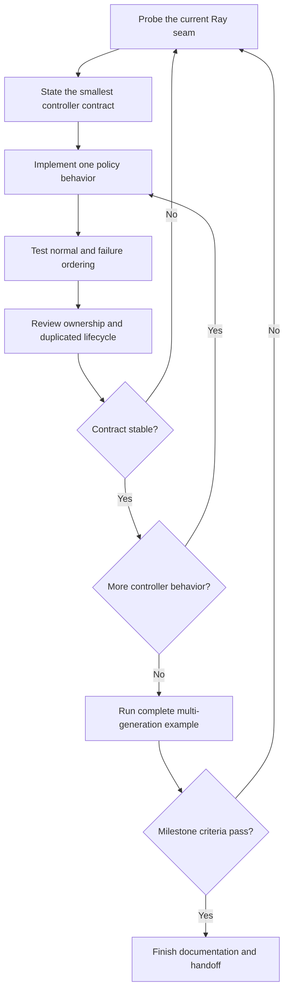

# Evolutionary-controller milestone plan

Status: proposed next-milestone execution plan  
Date: 2026-07-24  
Prerequisites:
[`decision_register.md`](../framework_alignment/decision_register.md),
[`framework_native_review.md`](../framework_alignment/framework_native_review.md)

## Milestone result

Deliver an independently invokable evolutionary controller that expresses the
population-decision side of Clan Tuning through the narrowest viable
specialization of synchronous Ray PBT.

The milestone is successful when the controller can receive a complete
population boundary, select one parent, retain one elite configuration, assign
the parent checkpoint to every next-generation member, produce optimizer-only
target configurations, and either continue or stop the complete population.

This milestone does not build the Lightning or DDP integration that produces the
reports and checkpoints.

## Controller contract

The controller owns:

- fitness direction and deterministic ranking policy;
- sole-parent selection;
- elite handling;
- optimizer-only mutation policy;
- validation of the configuration surface it mutates;
- collective continue or planned-completion decision;
- policy state required by the selected Ray PBT seam.

It does not own:

- training or validation cadence;
- metric computation;
- model or optimizer construction;
- checkpoint contents;
- DDP setup or collectives;
- dataloaders;
- resource admission;
- member-local checkpoint generation;
- whole-experiment recovery.

## Execution loop

The work proceeds through repeated contract probes, implementation, and repair.
Each work unit is reviewed against the standing framework-native review before
the next unit is selected.

## Work unit 1: qualify the Ray PBT seam

### Purpose

Establish the exact Ray behavior the controller will specialize before treating
private methods as a design contract.

### Execute

Build the smallest native Tune test that demonstrates:

- at least three trials in synchronous PBT;
- one report from every live trial at a population boundary;
- source checkpoint preparation before exploitation;
- source checkpoint and configuration assignment to targets;
- pause and resume ordering;
- two consecutive population decisions.

Then specialize the population partition so one deterministic winner is the only
source candidate and every other live trial is an exploitation target.

### Review

Reject the seam if the implementation must reproduce substantial Tune controller
behavior or coordinate trials outside PBT. In that case, return to the decision
register with direct evidence rather than hiding the mismatch behind adapters.

### Exit

A version-pinned executable test states the exact upstream assumptions and fails
clearly when they change.

## Work unit 2: define and implement parent selection

### Purpose

Make the sole-parent transition explicit and independently testable.

### Execute

Define:

- metric and direction;
- required complete population input;
- deterministic stable tie rule;
- behavior for missing, NaN, and infinite fitness;
- winner identity and target set;
- one unmutated elite configuration.

Keep the policy limited to the information already present at a Ray population
boundary. Do not introduce a Clan generation coordinator, report accumulator, or
checkpoint manager if synchronous PBT already owns that lifecycle.

### Exit

Focused tests prove the same results always produce the same parent and targets,
including ties and invalid inputs.

## Work unit 3: constrain optimizer-only mutation

### Purpose

Prevent Ray's general trial-configuration mutation surface from changing values
that would alter the shared-gradient workload.

### Execute

Choose the smallest configuration contract that can identify the optimizer
values available to mutation without becoming a second experiment schema.
Validate that the declared mutation space cannot alter model, data, batch,
augmentation, or other gradient-defining configuration.

Use Ray's native mutation mechanisms where they can express the accepted policy.
Add custom mutation logic only where a demonstrated Clan requirement remains.

### Exit

Tests prove that legal optimizer values mutate, the elite remains unchanged, and
nonoptimizer mutation declarations fail during setup.

## Work unit 4: collective completion and failure semantics

### Purpose

Ensure the controller cannot independently stop or recover one member.

### Execute

Investigate the narrowest Ray-native seam that can decide, at a complete
population boundary, either:

- select a parent and continue the whole population; or
- identify the final best member and stop the whole population.

Reject ordinary per-trial stop conditions for the supported path. Define how
missing trial results, trial errors, and population-size changes invalidate the
current Clan decision.

The controller need not implement distributed process termination; it must
produce or invoke the native experiment-level outcome that the later integration
can rely on.

### Exit

Tests show that planned completion is collective, one missing or failed member
prevents exploitation, and no trial continues as a smaller Clan.

## Work unit 5: state, auditability, and example

### Purpose

Make the controller usable and inspectable without constructing the later
Lightning integration.

### Execute

- Persist only policy state the chosen PBT seam genuinely requires.
- Document the sole-parent transition, elite rule, mutation boundary, tie rule,
  failure semantics, and upstream-version dependency.
- Emit or expose enough transition information to inspect parent, targets, and
  resulting optimizer configurations.
- Build a small native Ray example whose trainable reports synthetic fitness and
  checkpoints, so the population lifecycle is visible without mocked scheduler
  calls.

### Exit

The example completes several generations and its observed transitions match the
controller contract exactly.

## Milestone verification

The milestone passes only when:

1. a three-or-more-member synchronous population completes at least two
   generations;
2. one deterministic parent supplies every next-generation checkpoint;
3. exactly one elite configuration remains unmutated;
4. every other configuration receives legal optimizer-only mutation;
5. missing or invalid fitness fails clearly;
6. per-trial stopping and population loss are rejected;
7. planned completion stops the complete population at a boundary;
8. private Ray assumptions are protected by executable source-contract tests;
9. the controller can be used and tested without importing Lightning or
   constructing DDP;
10. documentation explains the contract without requiring the reader to infer it
    from Ray internals.

## Handoff to the integration milestone

The controller should hand later integration only native Ray outputs and
contracts: trial configuration, selected source checkpoint, population result,
and collective scheduling outcome.

The later milestone owns the production of comparable fitness, member-local
Lightning checkpoints, cross-trial DDP setup, optimizer reconciliation, data
configuration, and resource preflight. Its unresolved research is maintained in
[`integration_research_backlog.md`](../framework_alignment/integration_research_backlog.md).
