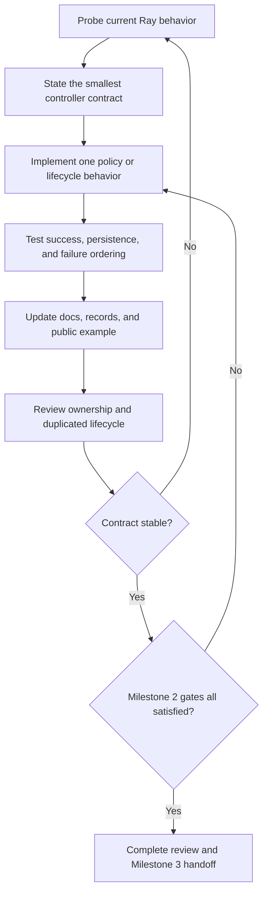

# Evolutionary-controller milestone plan

Status: proposed Milestone 2 execution plan  
Date: 2026-07-24  
Governing inputs:
[product roadmap](../product_roadmap.md),
[project decisions](../decisions/project_decisions.md),
[Milestone 2 gates](gates/milestone_2_evolutionary_subsystem.md),
[framework-native review](../reviews/framework_native_review.md)

## Milestone result

Deliver an independently invokable evolutionary controller that expresses the
population-decision side of Clan Tuning through the narrowest viable
specialization of synchronous Ray PBT.

The controller receives a complete population boundary, selects one parent,
retains one elite optimizer configuration, makes the parent state the sole basis
of the next generation, produces optimizer-only target configurations, and
either continues or completes the entire population.

This milestone does not build the Lightning or DDP integration that produces
real training reports and checkpoints.

## Milestone products

Milestone 2 delivers one coherent project result composed of:

- the public evolutionary controller and its transition records;
- focused policy and failure-ordering tests;
- version-pinned native Ray lifecycle and restoration contract tests;
- controller design, public API, configuration, failure, limitation, and
  transition-record documentation;
- a reproducible native Ray example using real trainables, reports, and
  checkpoints;
- a reviewed handoff that states exactly what Milestone 3 may rely on.

These products develop together. The implementation is not considered complete
while the test, documentation, example, or handoff contract remains undefined.

## Controller boundary

The controller owns:

- fitness direction and deterministic ranking policy;
- sole-parent selection;
- elite handling;
- optimizer-only mutation policy;
- validation of the configuration surface it mutates;
- collective continue or planned-completion decision;
- policy state required by the selected Ray PBT seam.

It does not own:

- training or validation cadence;
- metric computation;
- model or optimizer construction;
- checkpoint contents;
- DDP setup or collectives;
- dataloaders;
- resource admission;
- member-local Lightning checkpoint generation;
- general optimizer mapping.

## Execution method

Work proceeds one contract at a time. Each unit includes the implementation,
focused tests, affected documentation, and observable transition behavior needed
to judge that contract. Native lifecycle tests and the public example are
extended as soon as a behavior becomes externally meaningful rather than saved
for a final cleanup pass.

After every work unit:

1. run the relevant focused and native Ray contract tests;
2. update the design or reference section that explains the accepted behavior;
3. expose enough transition information for the example and reviewer to inspect
   the behavior;
4. apply the standing framework-native review;
5. reopen the owning decision or gate when evidence contradicts the contract.

## Work unit 1: qualify the synchronous PBT seam

### Purpose

Establish the exact Ray behavior the controller will specialize before private
methods or state become design assumptions.

### Work

Build the smallest native Tune contract test that demonstrates:

- at least three trials in synchronous PBT;
- one report from every live trial at a population boundary;
- source checkpoint preparation before exploitation;
- checkpoint and configuration assignment to targets;
- pause and resume ordering;
- two consecutive population decisions.

Then specialize the population partition so one deterministic winner is the only
source candidate and every other live trial is a target.

Record the pinned Ray seam, its owner, its lifecycle order, and the failure that
would reopen project decision P3.

### Repair condition

If this requires reproducing substantial Tune controller behavior or
coordinating trials outside PBT, stop and reopen project decision P3 with the
observed evidence.

### Exit evidence

- a version-pinned executable contract test;
- a design note stating the selected seam and ownership boundary;
- a minimal transition record visible from the public controller path.

## Work unit 2: qualify native experiment restoration

### Purpose

Determine whether Ray already preserves the specialized scheduler and trial
population across interruption before considering any Clan-specific recovery
state.

### Work

Using synthetic trainables and checkpoints, interrupt and restore:

- immediately after a completed population decision;
- while a synchronous population boundary is partially assembled;
- after a target has received a source checkpoint but before the next complete
  population report, when the native lifecycle exposes that state.

Use `Tuner.restore` and native persistent experiment state. Inspect restored
scheduler state, trial configuration, checkpoint lineage, pause status, and the
next population decision.

Document the supported restoration contract, explicit failure behavior, and
what remains for real Lightning state in Milestone 3.

### Repair condition

Do not add a generation manifest or custom transaction merely because the state
is difficult to inspect. Add recovery machinery only after direct evidence shows
that native Ray restoration cannot recover or explicitly reject an incoherent
population state.

### Exit evidence

- completed- and partial-boundary restoration contract tests;
- visible restored lineage and scheduler state;
- restoration and limitation documentation;
- updated example behavior when interruption can be shown concisely.

## Work unit 3: implement deterministic parent selection

### Purpose

Make the sole-parent population transition explicit and independently testable.

### Work

Define and test:

- metric and direction;
- complete population input;
- stable tie behavior;
- missing, NaN, infinite, duplicate-member, and incomplete population handling;
- deterministic handling of equal fitness values;
- winner identity and target set;
- one unmutated elite configuration.

Keep the policy limited to information already present at a Ray population
boundary. Do not introduce a second report accumulator, generation coordinator,
or checkpoint manager.

Update the public policy reference and example output so a reviewer can see why
a particular parent and target set were selected.

## Work unit 4: constrain optimizer-only mutation

### Purpose

Prevent Ray's general trial-configuration mutation surface from changing values
that define the shared-gradient workload.

### Work

Choose the smallest configuration contract that identifies mutable optimizer
values without becoming a second experiment schema. Reject model, data, batch,
augmentation, and other gradient-defining mutation during setup.

Use native Ray mutation behavior where it expresses the accepted policy. Add
custom mutation logic only for a demonstrated Clan-specific gap.

Test legal mutation, elite preservation, invalid declarations, and deterministic
configuration output. Document the allowed surface and show resulting
configurations in the public example.

## Work unit 5: implement collective completion and invalid-population behavior

### Purpose

Ensure the controller cannot independently complete, continue, or repair one
member.

### Work

Find the narrowest Ray-native seam that can decide at a complete boundary to:

- select a parent and continue the whole population; or
- identify the final best member and complete the whole population.

Reject ordinary per-trial stopping for the supported path. Define how missing
results, trial errors, and population-size changes invalidate the current
population decision.

The controller need not terminate DDP processes; Milestone 3 owns distributed
termination behavior.

Test success and failure ordering through native Ray execution. Document the
collective contract and expose the outcome in transition records and example
output.

## Work unit 6: complete the public controller products

### Purpose

Make the subsystem independently usable, testable, reviewable, and teachable
without constructing Lightning or DDP.

### Work

- Persist only policy state the selected PBT seam requires.
- Complete focused policy, failure, persistence, and native Ray restoration test
  suites.
- Complete controller design, public API, configuration, failure, limitation,
  restoration, and transition-record documentation.
- Build the native Ray example using the public controller, at least three real
  Tune trainables, real reports and checkpoints, and at least two generations.
- Make fitness, parent, elite, targets, mutations, checkpoint lineage, restore,
  and collective completion inspectable.
- Explain how to run the example and read its output.
- Produce the Milestone 3 handoff describing only the public controller contract
  and native Ray outputs the integration may rely on.

### Exit evidence

The implementation, tests, documentation, example, and handoff agree on one
controller contract and collectively satisfy the Milestone 2 gate file.

## Milestone closure

Close Milestone 2 only through the
[Milestone 2 gate file](gates/milestone_2_evolutionary_subsystem.md). The plan is
an execution route, not a substitute for gate evidence.

The handoff to Milestone 3 consists only of the public controller contract and
native Ray outputs: trial configuration, selected source checkpoint, population
result, restoration behavior, transition records, and collective scheduling
outcome.
