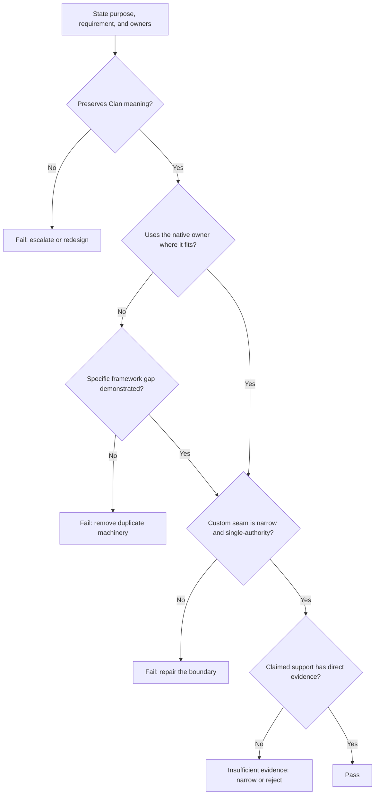

# Framework-native engineering review

Status: standing go/no-go review under Milestone 1 alignment review  
Date: 2026-07-24

## Purpose

Use this review whenever a design or implementation changes a meaningful
ClanBasedTuning boundary. It answers one question:

> Does this unit preserve the Clan mechanism while leaving ordinary framework
> behavior with its native owner?

This is not a design specification or milestone plan. Detailed project
requirements belong in the gate where the roadmap makes them enforceable;
detailed component behavior belongs in the design artifact for the component
that owns it.

Accepted project decisions remain governing inputs unless an explicit alignment
record reopens a clause. A reopened clause may not be used as implementation
authority until its replacement is accepted.

## Application

State the unit's purpose, inputs, outputs, lifecycle position, project
requirement, and component/framework owners. Apply the checks in order. Stop at
the first failure, repair the responsible design or contract, and repeat the
review.

## 1. Preserve the Clan mechanism

Confirm that the unit preserves the algorithmic properties established by the
roadmap and governing project decisions: the complete live population
contributes to shared-gradient training, variation remains optimizer-side during
a round, fitness is comparable, and one parent supplies the next generation.

**Fail** when engineering convenience changes one of those properties. That is
a project decision, not a local implementation choice.

## 2. Use the native owner

Trace every responsibility in the unit to its current owner in PyTorch,
Lightning, Ray Tune, ClanBasedTuning, or the user application. Use the framework
owner unchanged when its contract already fits.

**Fail** when ClanBasedTuning repeats ordinary scheduling, training, validation,
distribution, checkpoint, optimizer, data, resource, or lifecycle behavior
merely to make it locally convenient.

## 3. Require a demonstrated framework gap

Custom behavior requires a concrete gap statement:

- the Clan behavior required;
- the native behavior that conflicts with or omits it;
- the smallest seam capable of bridging the difference;
- the evidence showing that ordinary composition is insufficient.

**Fail** when the justification is symmetry, speculative generality,
proof-of-concept compatibility, preference for local control, or discomfort with
a version-sensitive seam that has not yet been tested.

## 4. Keep one authority and a narrow seam

The custom seam must add only the missing Clan behavior. Policy, state, and
execution decisions must each have one authoritative owner. Removing the seam
should remove the Clan-specific behavior without taking an ordinary framework
lifecycle with it.

**Fail** when responsibilities overlap, configuration is mirrored without need,
a component both decides and executes framework-owned work, or custom machinery
mainly exists to coordinate other custom machinery.

## 5. Match support to evidence

For every version-sensitive, distributed, persistence, recovery, performance,
or failure boundary, identify the direct source or executable contract test and
the support envelope it establishes.

Exact source revisions and test environments provide reproducibility. Public
dependency constraints and support claims must express only the compatibility
range directly qualified by those tests.

Return **insufficient evidence** when the ownership appears correct but the
claimed behavior has not been qualified. Narrow the claim or reject the
configuration before expensive work begins.

## Result

- **Pass:** all five checks hold for the claimed project result and support
  envelope.
- **Fail:** the unit changes Clan meaning, duplicates a native owner, or creates
  conflicting authority.
- **Insufficient evidence:** the boundary is plausible, but the support claim is
  not established.

## Supporting documents

- [Product roadmap](../product_roadmap.md)
- [Project decisions and reopened clauses](../decisions/project_decisions.md)
- [Milestone gates](../milestones/README.md)
- [Framework evidence ledger](../framework_alignment/evidence_ledger.md)
